# Securing-Azure-with-RBAC-Least-Privilege

## Objective
 In this lab, I configured role-based access controls. These controls will configure permissions and define the scope of what actions users can and cannot perform. I will make subscription management easier using management groups.

Task 1: Implement management groups 

Task 2: Review and assign a built-in Azure role.

Task 3: Create a custom RBAC role.

Task 4: Monitor role assignments with the Activity Log. 

Let's first implement management groups. On my Azure portal, I will search for Management groups. I will then create a new group. 

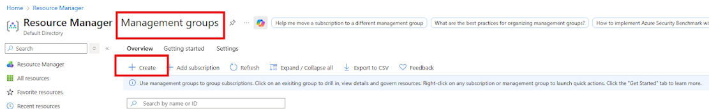

I will fill in the following settings. 

Management Group ID: Az104-mg1

Management group display name: Az104-mg1

Then I clicked on create. 

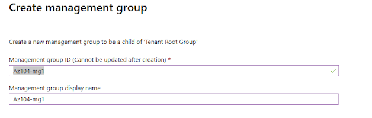

I then refreshed the page, and I can see my new group. Let me click into Az-104-mg1. 
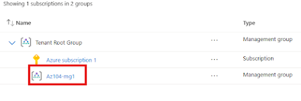

Next, I will select the Access Control tab on the left-hand side and then select the Roles tab. I will select plus add from the drop-down menu and select add role assignment.

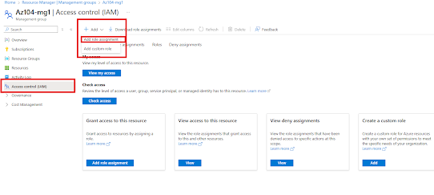

From this new menu, I can see the job function roles that I will assign the specific role to and the description of what it means. 

For example, if I search for a virtual machine, it will match any roles with the specific keywords. For this project, I am looking for a virtual machine contributor. The description says it will let the role manage virtual machines, but not grant access to them, and not the virtual network or storage account they're connected to. 

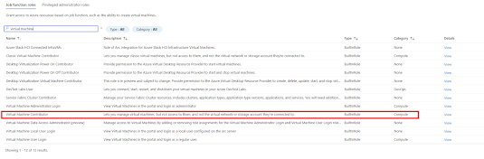

This is great for my Help Desk position (myself). After selecting the role and continuing on to the next page, I will select the members who will be the IT lab administrators.

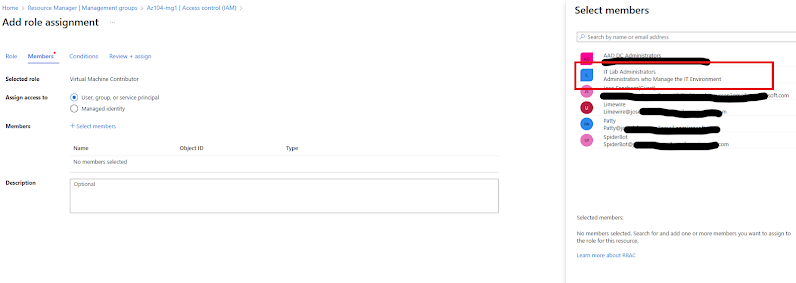

I will then review and create. 
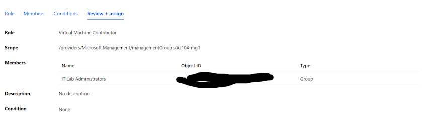

On the roll assignment tab, I can confirm that the lab administrators have the virtual machine contributor role assigned to them. 
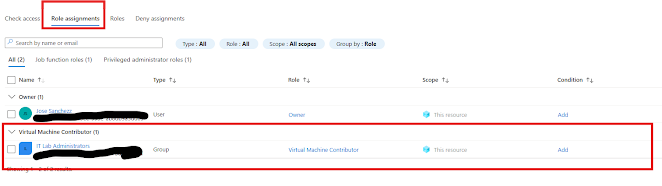

Task 3: Back to the access control tab, I will now assign a new custom role. 
Role-based access controls are crucial for enforcing the principle of least privilege. Least privilege means every user, service, or application should only have the minimum permissions necessary to perform their tasks. In custom role-based access control roles, it lets me fine-tune permissions beyond the broad built-in roles like owner or contributor.

Over time, users can accumulate permissions they no longer need, which prevents privilege creep. With custom RBAC, I can create tasks specifically for those roles that map directly to job responsibilities, and it can prevent people from having broad or outdated access rights. For example, the help desk technician might only need to reset a password or unlock an account, but does not need full Active Directory or virtual machine management access as we did previously.

In time for auditing, it will be easier to track who has access to what and why. Azure activity logs and access reviews can clearly show which custom roles are being used and by whom. In custom RBAC, it helps enforce separation of duties, ensuring that no single person has end-to-end control that could lead to any abuse. For example, one team can manage network configurations while another team can handle VM creation without overlapping any permissions, which minimizes the risk of intentional or accidental misuse.

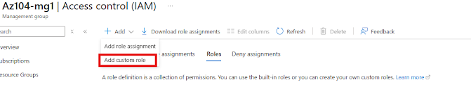

In the Basics tab, I will fill in the following. 
Custom Role name: Custom Support Request
Description: A Custom Contributor role for support requests. 
Baseline Permissions: Clone a role.
Role To Clone: Support Request Contributor. 

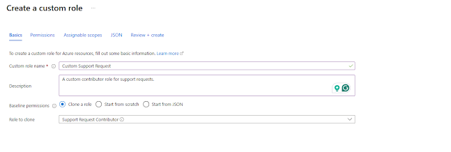

I will select next and move on to the permissions tab, and then select plus exclude permissions. In the resource provider search field, I will enter. Support and select Microsoft support.

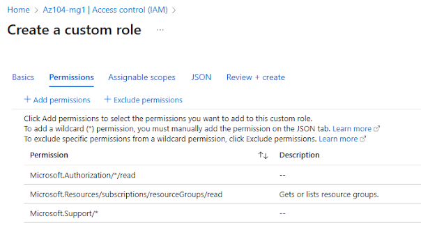

I will also add Registrar's Support Resource Provider permission. 
This means when I register a resource provider, I'm telling Azure, "Hey, I want to use this type of service in my subscription, please enable it for me." Azure might want to block me from creating a resource from that provider because my subscription doesn't really know that it's allowed to use it yet.

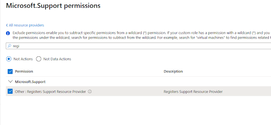

Let's review and create. 

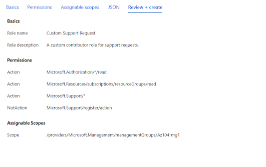

Once that was created, I went to my activity log of my management groups and took a look at what was created.

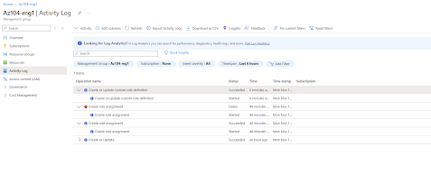

