# Azure-Virtual-Network-Designing-Subnets-Security-Groups-and-DNS-Zones

## Objective
In this lab, I designed a scalable, secure, and organized virtual network in Azure, just like a real company would when moving to the cloud or expanding infrastructure for the company. The fictional or global organization JoseCyber has existing workloads and users but expects to grow, which means more departments, applications, and devices in the future are going to be needed to configure and implement. In order to prepare for that, the company needs a networking structure that prevents IP conflicts, supports clear segmentation, and can scale up easily without redesigning everything later. For this project, I'm creating 2V Nets, one for core services and one for manufacturing.

Task 1: Create a virtual network with subnets using the portal.

Task 2: Create a virtual network and subnets using a template.

Task 3: Create and configure communication between an Application Security Group and a Network Security Group.

Task 4: Configure public and private Azure DNS zones.

Task 1

I went to my Azure portal and searched for virtual Networks. I clicked on Create and completed the Basic Tab with the following: 

Resource Group: JoseCyberHomeLabs

Name: JoseCyberHL

Region: US West 

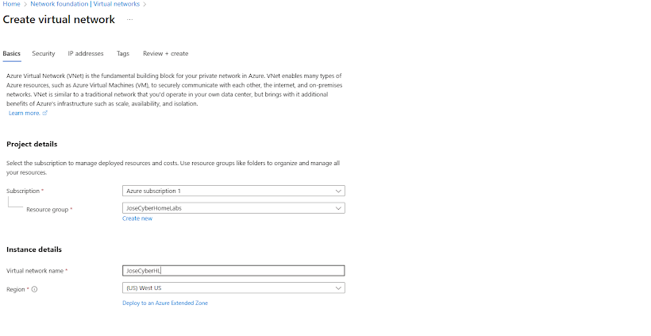

1) I then changed the IP Addresses tab and changed the IP Address to 10.200.0.0/16
2) I then selected + Add a subnet. 

Subnet: SharedServicesSubnet 

Options: Subnet name ( SharedServicesSubnet)

Starting Address: 10.20.10.0

Size: /24
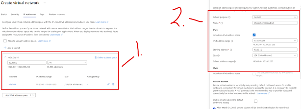

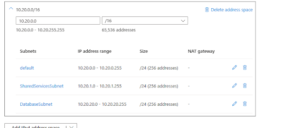

Subnet: DatabaseSubnet

Options: Subnet name (DatabaseSubnet) 

Starting Address: 10.20.20.0

Size: /24

Task 2:

Now I need to create a manufacturing VNet virtual network and associate it with my subnets. The organization Jose Cyber anticipates growth in the manufacturing offices, so the subnets are sized for that growth. I will need to use the template that I've already created for my core services VNet.

I located the template.json file and exported it to my downloads folder.
I then edited the file using Visual Studio Code to change all occurrences below.

1) replaced all occurrences of "JoseCyberHL" with "JoseCyberManVnet"

2) replaced all occurrences of "10.20.0.0" with "10.30.0.0."

3)Change all occurrences of SharedServicesSubnet to SensorSubnet1.

4) Change all occurrences of 10.20.10.0/24 to 10.30.20.0/24.

5) Change all occurrences of DatabaseSubnet to SensorSubnet2.

6) Change all occurrences of 10.20.20.0/24 to 10.30.21.0/24.

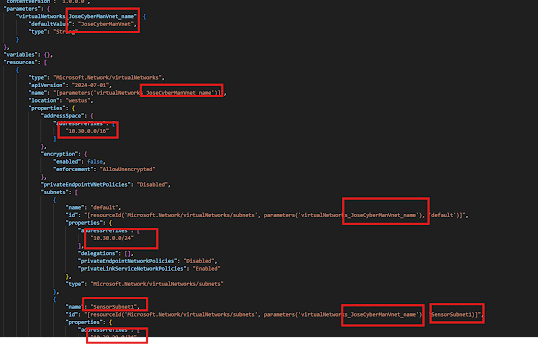

Back to the Portal on Azure, I need to deploy the custom template I worked on. Click on "Build your own Template in the editor." 

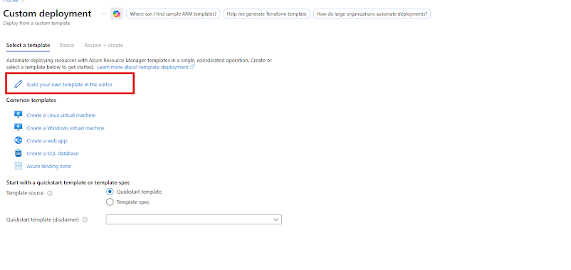

I click on Load file, I then select the Template.json File with my Manufacturing changes, then select Save. 
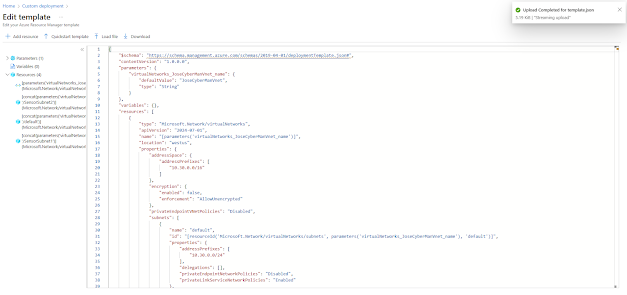

I ran into an error. 
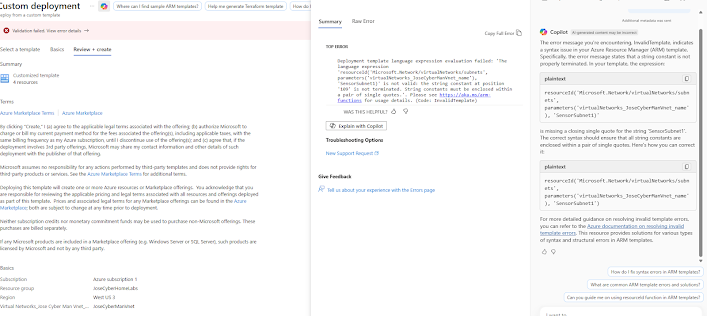

 "code": "InvalidTemplate",

  "message": "Deployment template language expression evaluation failed: 'The language expression 'resourceId('Microsoft.Network/virtualNetworks/subnets', parameters('virtualNetworks_JoseCyberManVnet_name'), 'SensorSubnet1)' is not valid: the string constant at position '109' is not terminated. String constants must be enclosed within a pair of single quotes. Please see https://aka.ms/arm-functions for usage details."

I see that I erased the quotation mark at the end of the syntax in Python. I was able to fix it by going back into the template.json and correcting it. 

"id": "[resourceId('Microsoft.Network/virtualNetworks/subnets', parameters('virtualNetworks_JoseCyberManVnet_name'), 'SensorSubnet1')]",

Let's review and create the deployment. 

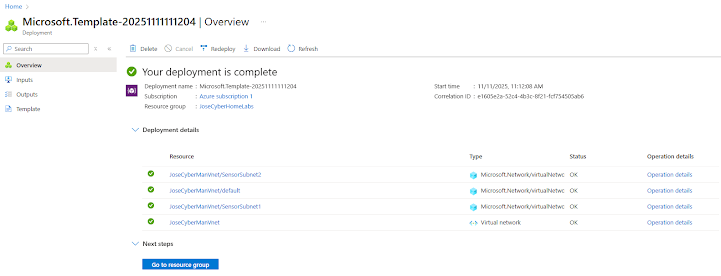

Task 3: In this task, I need to create an application security group and a network security group. An application security group is like a tag for network interfaces, such as VMs, that group workloads by their function, not by IP addresses. Let's create two groups. 

asg-web for Web Servers
asg-db for Databases

When I make the rules for my web servers, I don't need to remember all IP addresses; I can just make the rules for the group name.

Network security groups are similar to a firewall that protects my virtual network, VNet, or subnet. This controls the traffic that can come in and what can go out.

I will be creating an inbound rule allowing ASG traffic to the web group on port 80, which is HTTP, and port 443, HTTPS. Because those ports are used for web traffic only, the web servers should be able to reach the protected subnet no one else.

I will also be adding an outbound rule denying Internet access. I do not want anything in this subnet to go out to the Internet, which means I want my servers safe from downloading bad software by mistake, sending sensitive data out, and talking to anything outside of my secure network.

In the portal, I need to search for application security groups. Then I would have to create and provide the basic information, which is down below. 

Setting: Value
Subscription:	My subscription
Resource group:	JoseCyberHomeLabs
Name:	asg-web
Region:	West US

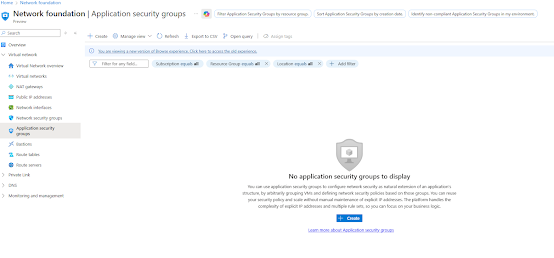
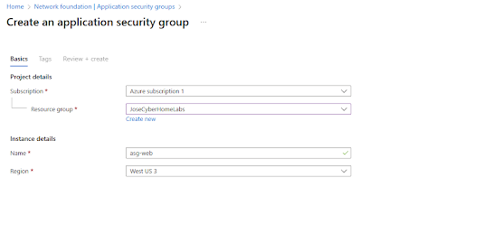

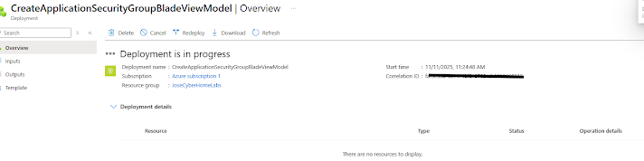

Now, following the same steps I took, I need to create a network security group and associate it with JoseCyberHomelabs with the settings below.
Setting	Value
Subscription	My subscription
Resource group: JoseCyberHomeLabs
Name	myNSGSecure
Region	East US

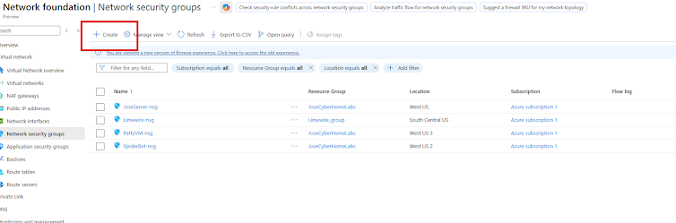
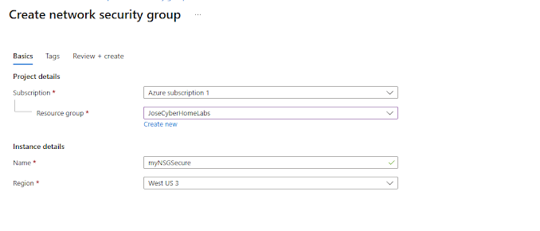

I will need to associate it with my subnet. I will need to go to the resource --> Settings --> Subnets --> Associate. 

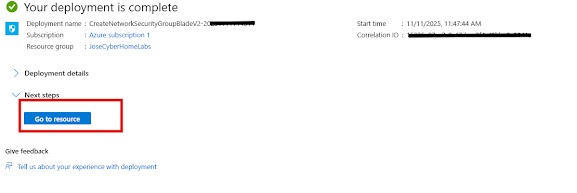
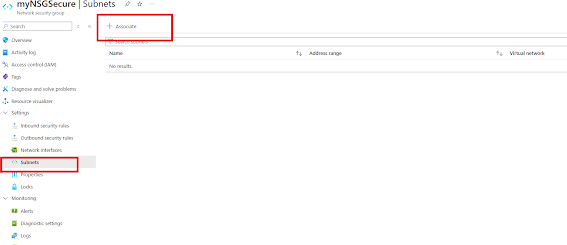
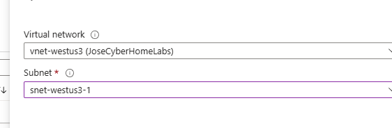

Now, in my Inbound Security rule, I can add a new rule to allow ASG Traffic. 

Setting	Value
Source	Application security group
Source application security groups	asg-web
Source port ranges	*
Destination	Any
Service	Custom (notice your other choices)
Destination port ranges	80,443
Protocol	TCP
Action	Allow
Priority	100
Name	AllowASG
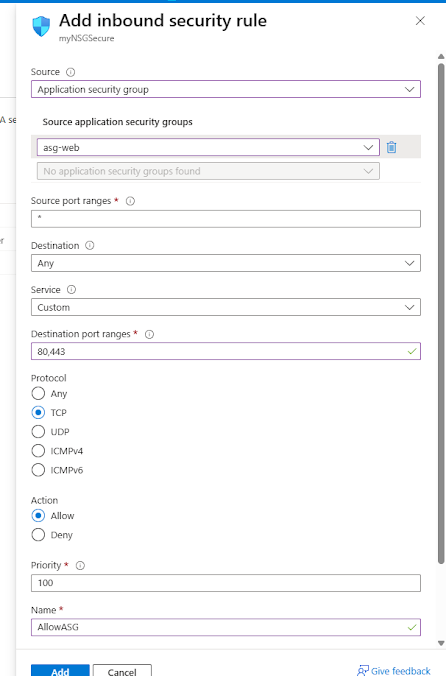

Great, now I want to configure my outbound NSG rule that denies internet access. 
Setting	Value
Source	Any
Source port ranges	*
Destination	Service tag
Destination service tag	Internet
Service	Custom
Destination port ranges	*
Protocol	Any
Action	Deny
Priority	4096
Name	DenyInternetOutbound

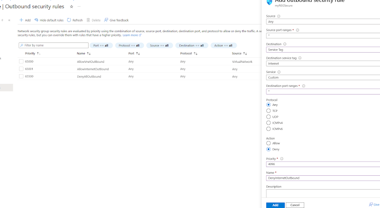

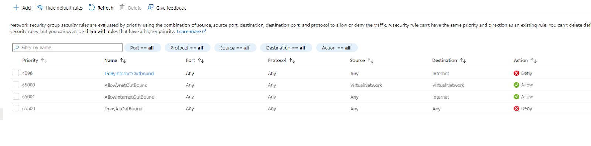

Task 4: We actually created this DNS Zone previously in another lab project. Let's do it once more. Property	Value
Subscription	My subscription
Resource group	JoseCyberHomeLabs
Name	JoseCyber.blog
Region	West US

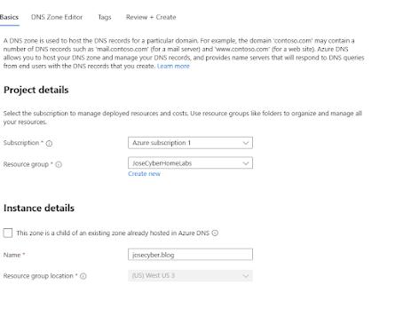

Review and Create, I then went to "go to resource."

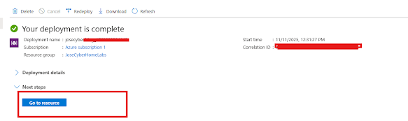

I then went to Record Sets and created a record set. I then configured the settings as seen below. 

Name:	www
Type:	A
TTL:	1
IP address:  10.1.1.4
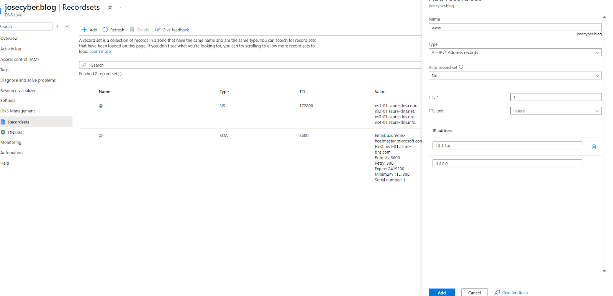

I then created a Private DNS Zone. 
In the portal, I searched for and selected "Private DNS Zones. "
I then selected + Create
And input the information as follows: 
Subscription	My subscription
Resource group	JoseCyberHomeLabs
Name	private.josecyber.blog
Region	West US

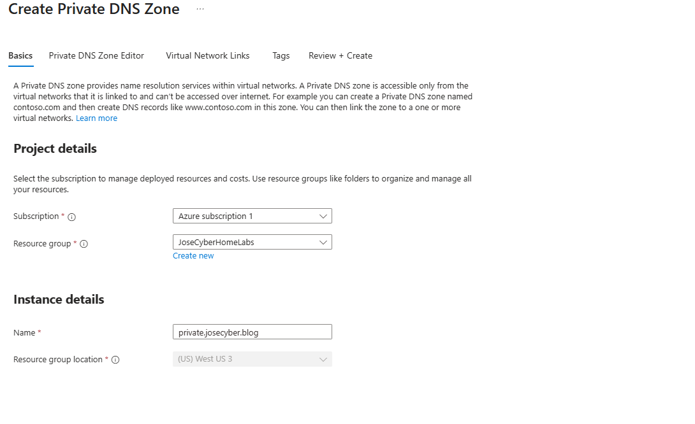

I then went to the resource page and clicked on DNS Management --> Recordsets --> +Add. 
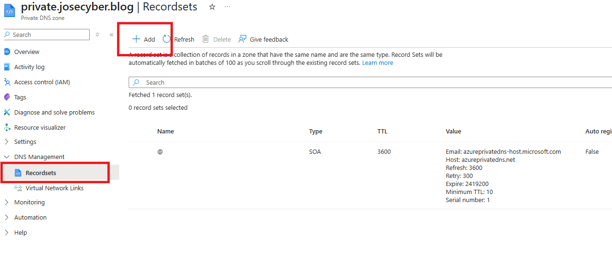

Input the following configurations below: 

Name:	sensorvm
Type:	A
TTL: 1
IP address:	10.1.1.4
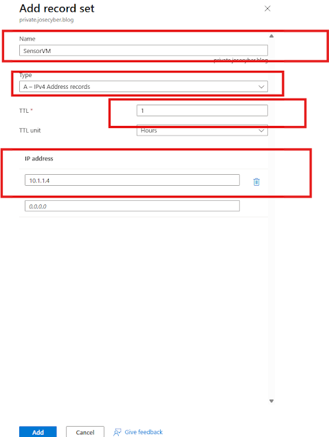

I built a virtual network in Azure to simulate a company environment in the cloud. I created multiple subnets to organize departments and prevent IP conflicts, making the setup easier to manage and troubleshoot in the future. I also configured security groups to control network traffic and protect key resources, web and data servers. I was able to configure network security groups and application security groups by applying rules to groups instead of individual machines. Finally, I set up Azure DNS for internal and external name resolution, ensuring smooth and secure communication between systems.
