# Azure-VM-User-Account-Setup

## Objective
Since I have experience with Active Directory in a Virtual Machine network, I wanted to learn more about the Cloud space and gain hands-on experience with Azure Active Directory. I will launch my Azure home lab to bridge the on-prem Active Directory experience with cloud and virtualization. Then I will create an Entra/Azure AD tenant, add three user accounts, Patty, SpiderBot, and Limewire, and deploy three Windows Server VMs in a dedicated Resource Group called "JoseCyberHomeLab."

### Skills Learned

- Gained hands-on experience setting up user accounts and access in Microsoft Azure, similar to how employees are onboarded in real companies.
- Learned how cloud identity systems work by creating and managing users in Azure Active Directory (Entra ID).
- Built and organized a cloud lab environment, grouping related systems for easier management.
- Created and launched virtual computers (servers) in the cloud for different users.
- Learned how companies use the cloud to securely manage people, systems, and access.

## Steps
First, I need to set up a Microsoft Account. 

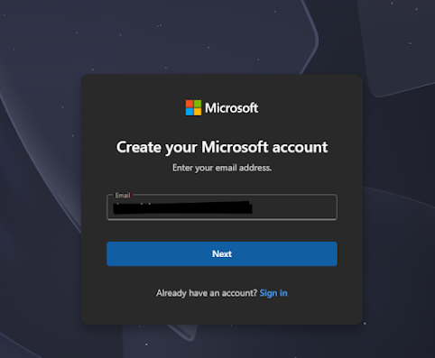

It will send a code to verify my Email address. I filled out the necessary questions that were prompted and continued. After verifying my account and the personal information Azure needed am now at the QuickStart Center. 

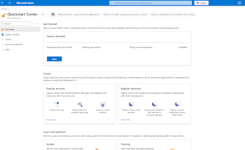

From here, I want to go to the search Menu and type " Azure Active Directory". 

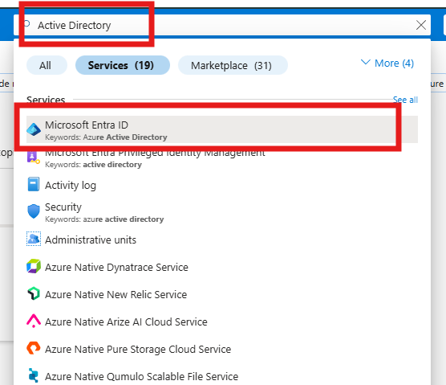

I want to create new users for my organization. I will be using the same organization I've used before, JoseCyber." I want to create 3 users. They will be Patty, Spiderbot, and Limewire. 

I clicked on the left-hand side under Manage and clicked on "Users."

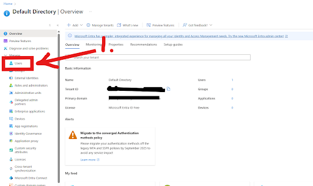

Then I clicked on New User, and I filled out the information for Patty. I also want to make sure that once I create this new user, the account is available. But in a real work environment, the user might not be ready to work for another 2 weeks, so I might just create the account and then enable it later on. 

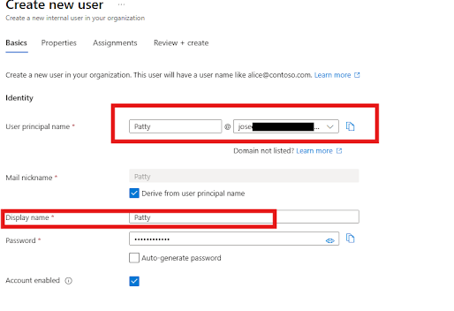

Back at the Users page, I can now see that Patty's account was created. 
I will do the same for Spiderbot and Limewire.
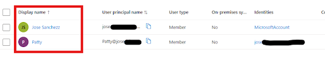

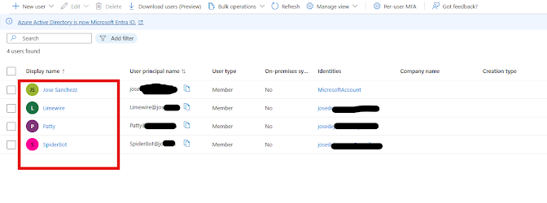

Let's set up some Virtual Machines for these Users. In the search bar, I typed in "Virtual Machine."
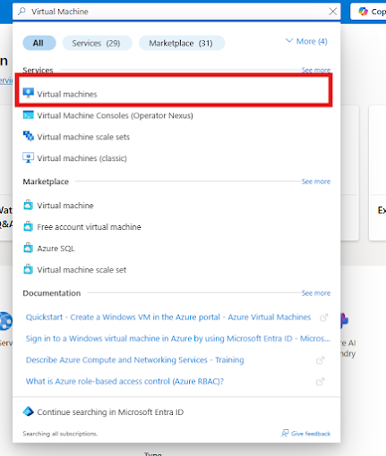

1) I then clicked on Create
2) I clicked on Azure Virtual Machine. 
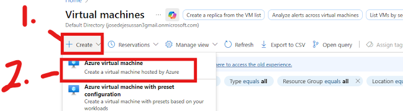

I need to create a new Resource Group, which is a container that will hold related resources for an Azure Solution. This will be called JoseCyberHomeLab. 

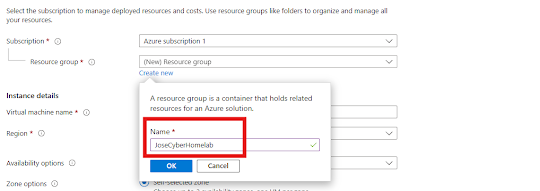

I will then select the Image, and previously, when I did this in January 2025, it did have Windows 2019, but they have changed it to Windows Server 2025 Datacenter. 

Windows Server Datacenter: Azure Edition is an edition of Windows Server focused on innovation and virtualization optimized to run on Azure. Azure Edition features a Long-Term Servicing Channel (LTSC) and yearly product updates, with two major product updates in the first 3 years. Azure Edition also brings new functionality to Windows Server users faster than the Standard and Datacenter editions of Windows Server.

I then changed the size and added an 8 GiB memory to the VM. 
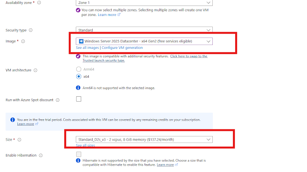

It then asked me to name the Administrator account username "PattyVM" and give it a password. 
I then left everything as is with the Inbound Port Rules.

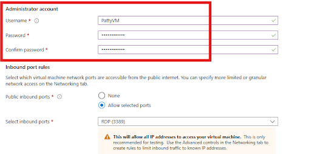

It will take a while for the VM to be set up by Azure. 

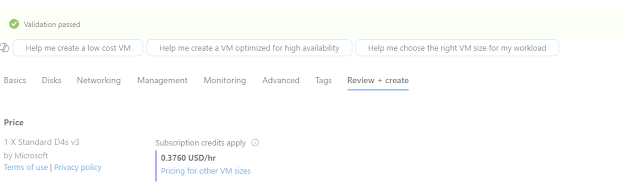

Following the same Steps, I encountered a problem where Azure did not like that the VM had the server in a specific region; it gave me a suggestion where it would be validated, and it worked out. I set the new VM for SpiderBot. 

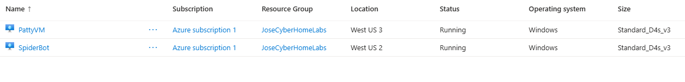

I followed the previous step, and this time I picked another Region for the Limewire user. South Central US. 
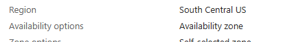

After giving Azure a few minutes to create all 3 VMs successfully, I now have 3 VMs ready to go. 

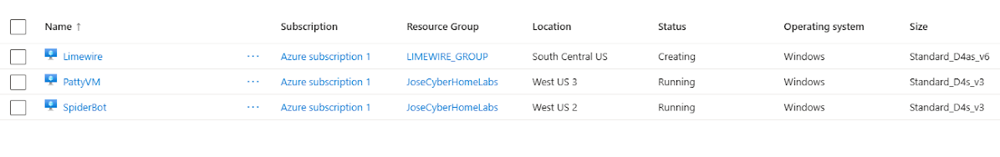

