# Securing-and-Managing-Data-in-Azure-Storage

## Objective
A storage account in Azure is like a container for all my data-related services; it provides a secure, scalable space in the cloud where I can store my files, blobs (objects), queues, tables, or disks. This is my company's central storage hub for everything, from employee documents to customer application data to virtual machine disks and backups. 

In this project, I configured security and access, redundancy and data durability, cost optimization for the company, data protection, monitoring, and compliance. Companies often get breached through misconfigured storage. A team must audit its access policy regularly and enforce Azure policy to deny anonymous access in order for its data to be protected. I need to log into my Azure account and start the process. 

### Skills Learned

- Set up cloud storage with security controls to prevent accidental public access and data leaks.
- Made decisions that balance data protection, cost, and business risk, similar to real-world IT environments.
- Organized data into private and public storage areas, understanding when information should or should not be publicly accessible.
- Implemented backup and recovery options to restore files if they are accidentally deleted.
- Used automation to reduce storage costs over time by moving older files to lower-cost storage.

## Steps

I need to search for the Storage Center. I will then need to create a new storage account. 

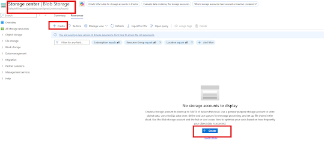

I will keep the subscription as is, with the resource group as "JoseCyberHomeLabs."
I will create a Storage account named " jsusahomelabs".
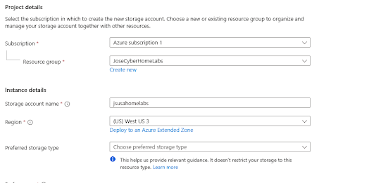

Azure Storage offers several types of storage accounts. Each type supports different features and has its own pricing model.

Type of storage account,	Supported storage services, Redundancy options, Usage
Standard general-purpose v2	Blob Storage (including Data Lake Storage1), Queue Storage, Table Storage, and Azure Files	Locally redundant storage (LRS) / geo-redundant storage (GRS) / read-access geo-redundant storage (RA-GRS)

Zone-redundant storage (ZRS) / geo-zone-redundant storage (GZRS) / read-access geo-zone-redundant storage (RA-GZRS)2	Standard storage account type for blobs, file shares, queues, and tables. Recommended for most scenarios using Azure Storage. If you want support for network file system (NFS) in Azure Files, use the premium file shares account type.
Premium block blobs3	Blob Storage (including Data Lake Storage1)	LRS

ZRS2	Premium storage account type for block blobs and append blobs. Recommended for scenarios with high transaction rates or that use smaller objects or require consistently low storage latency. Learn more about example workloads.
Premium file shares3	Azure Files	LRS

ZRS2	Premium storage account type for file shares only. Recommended for enterprise or high-performance scale applications. Use this account type if you want a storage account that supports both Server Message Block (SMB) and NFS file shares.
Premium page blobs3	Page blobs only	LRS

ZRS2	Premium storage account type for page blobs only. Learn more about page blobs and sample use cases.

For the preferred storage typo I will select Azure Blob Storage or Azure Data Lake Storage Gen 2. 
I will keep the performance Standard. 

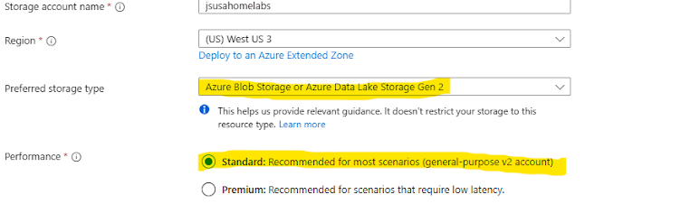

For Redundancy, it gives me 4 different Options: Locally Redundant storage (LRS), Geo-redundant storage (GRS), Zone redundant Storage (ZRS), and Geo-zone-redundant storage (GZRS). 
If something breaks down a disc, a data center, or even a whole region, my data will be safe and available. Azure refers to the redundancy of how many copies of my data Azure keeps, and where those copies are stored to protect against hardware failure, outages, or disasters. 

Locally redundant storage keeps 3 copies of my data with a single Azure data center; it will protect against hardware failures, but not against a total data center outage.

Zone redundant storage keeps 3 copies across different availability zones within the same Azure region and survives the entire zone failure, such as a power loss or flooding in one building. For instance, this can be stored in shared files for New York and LA, and if one data center in New York fails, users can still access those files from LA.

Geo redundant storage keeps 6 copies of my data, three locally in a primary region and three in a secondary region hundreds of miles away. This will keep my data alive if there were to be a regional disaster, such as my data being kept in the US but it's surviving in Australia.

Geo zone redundant storage keeps the best of ZRSNGRS, meaning it keeps 3 copies across zones in the primary region and replicates those 3 copies to a secondary region. It survives both a zone-level and a region-level failure.

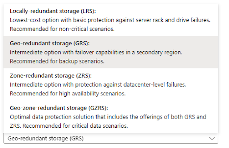

This is important because it can be overlooked in how the IT team chooses the right redundancy option. This not only affects our data if there are any failures, but also how much we would have to pay for the cloud provider to maintain our data in these different redundancy options. For instance, if I'm working in a company where there is minimal coverage, we would have to think of lower cost and higher risk as opposed to full coverage with higher cost and minimal risk. 

I will select the Geo zone redundant storage and check off the box that says make read access to data available in the event of a regional unavailability. Then I will click on next. 

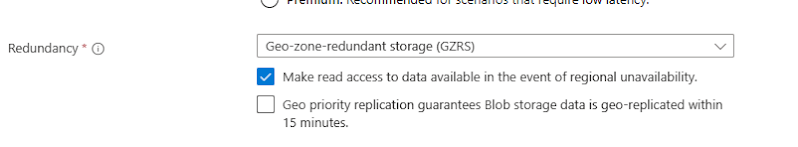

It tells me to configure security settings that impact your storage account. 
The first option requires Secure Transfer for REST API operations. 

This means it will only allow encrypted connections, such as HTTPS, when someone tries to access data in the storage account. If someone tries to connect using http://whichis encrypted, Azure will reject the request. This means that if my application interacts with Azure storage, such as uploading a file, reading a BLOB, or running an API call, that communication can go over HTTP or HTTPS. So if I enable secure transfer required this will ensure that the data in transit encryption will follow only encrypted connections.

I will have this selected to keep my data secure. 

Then it asks me to enable anonymous access on individual containers. 
Meaning, Azure BLOB storage is like a cloud-based file system where you can store objects such as documents, images, or logs inside containers. When this setting is disabled, that means that no one can make containers public and would require authentication, but if it is enabled, authorized users, such as admins or developers they can choose to make certain containers publicly accessible without login. What anonymous access really means is that anyone with a container URL can read the files. 

I was reading why Azure introduces settings, and it stated that in the past times admins could easily make BLOB containers public to either host images for websites or for code. But this led to accidental data leaks within many organizations, unknowingly exposing sensitive data through their anonymous BLOB URLs. To prevent that, Microsoft changed the default to making all the containers private by default, and added this global check so that organizations can control whether public access can even be turned on. 

The way I view it is you want to keep all your HR confidential reports private, and make your marketing assets like logos and brochures public. 

I will have this selected. 

Then it asks me to enable storage account key access. 
Meaning every Azure storage account comes with two master keys. If someone has one of those keys, they can access all the containers and blobs, create or delete data, and generate shared access signatures such as SAS tokens to share access with others. This gives the keys to the castle. If I enable this I'm allowing applications or users authenticating using the account name and the key or they are allowed to use the shared access signature generated by using that key period it is simple and widely compatible but not the most secure method if I disable this all the key based authentication stops working, any app or script using account keys or SAS tokens will fail to connect. Access must now go through the Azure AD-based authentication.
I will have this selected. And then keep the TLS Version as Version 1.2.

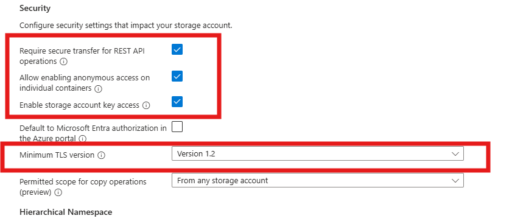

I will leave everything as is and click on Next. 
On Networking, for now, I will keep everything as is. 

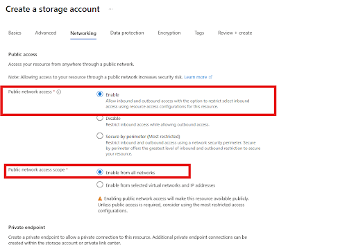

In the Data Protection tab, I want to enable Point in Time Restore for containers. I can restore containers at any given point in time that changes. If I do daily backups, I can restore the container to a previous date. 

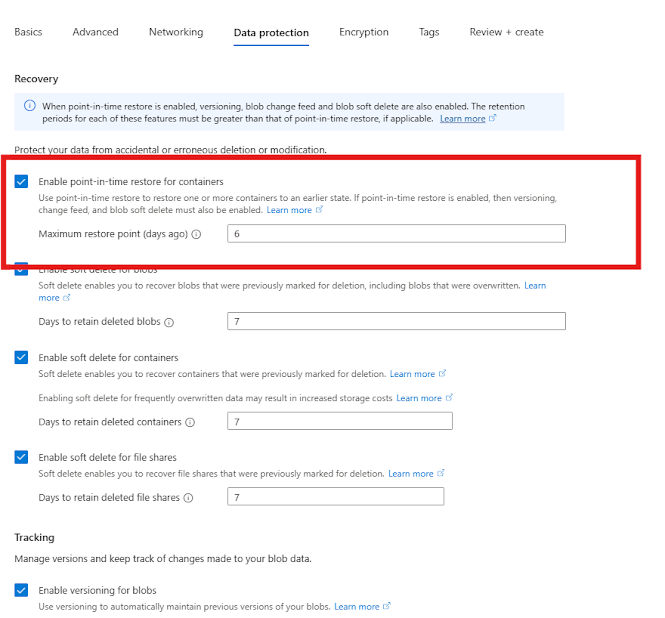

In the Encryptions tab, I want to select Microsoft Managed Keys; I want Microsoft's Keys, not my own. I also want to enable support for customer-managed keys for all services, such as blobs, files, tables, and queues. I also want to enable infrastructure encryption. By default, Azure encrypts storage account data at rest. Infrastructure encryption adds a second layer of encryption to your storage account’s data.

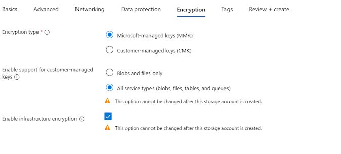

The Review and Create tab will give me an overview of everything we created and what we want in this storage account. I will click on Create at the bottom. 

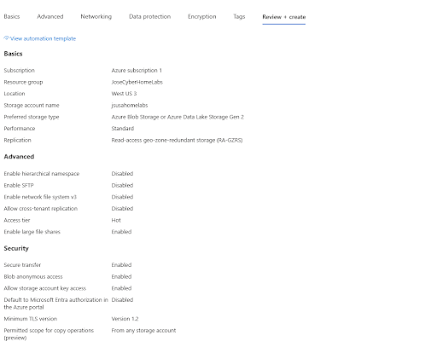

Success! 
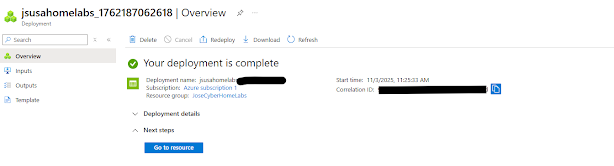

Now, once I click on the Resource Group, I can see everything listed in this Storage account. It has my VMs and Users. 

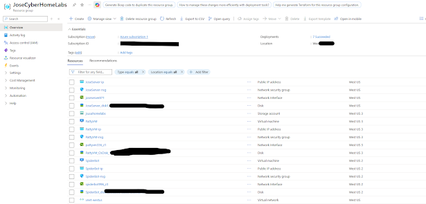

Now I will be creating a container. On the left-hand side, I will go under Data Storage and click on Containers. 

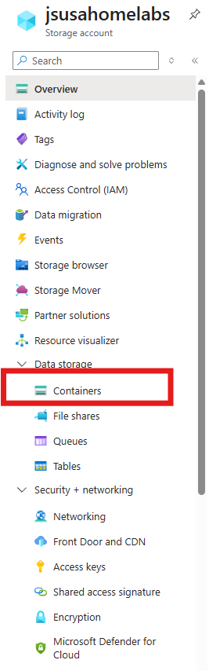

I clicked on Add Container. 

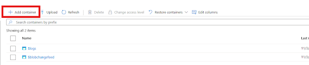

I will name the new container, "private-container," and select the Private access level. 
Then click on Create. 

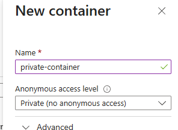

I can now see it was created. 

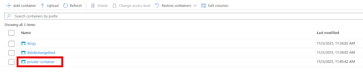

Let's add my Resume to the Private container.
I clicked on upload and browsed for my resume on my computer. 

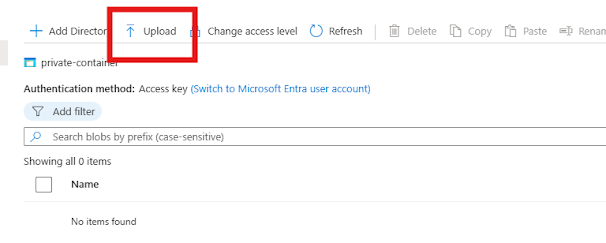
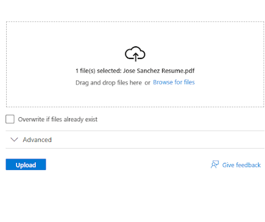

I then clicked on Upload, and I can see it on the dashboard. 
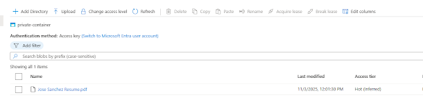

If I click on the file, I can view the information about the file. Times of creation, Last modified, Size, MD5 Hash. 

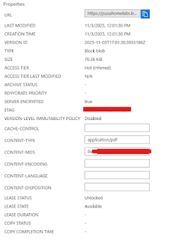

There is a tab called Generate SAS which is like a temporary hall pass that gives someone limited access to your Azure Storage data without giving them the main key to the building. It is a URL with temporary access; they might have permissions to read, write, delete, and list. 
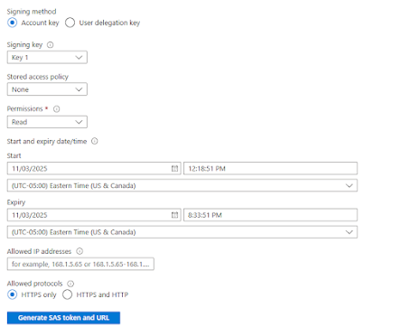

If I go to the tab overview and copy the URL to view the PDF file that I uploaded, I will get hit with an error because it is private. 

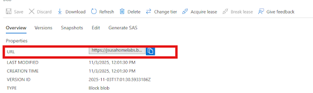

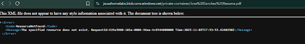

Let's create a new container and call it "public-container" and add my resume, and change the access level to Blob (anonymous read access for blobs only). 

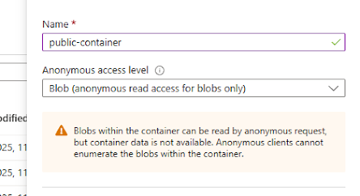

Then upload the same file and copy the URL Link and open a new tab, I can now view the file without a signature. 

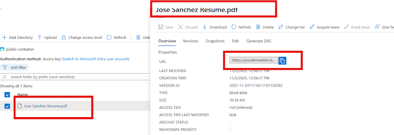

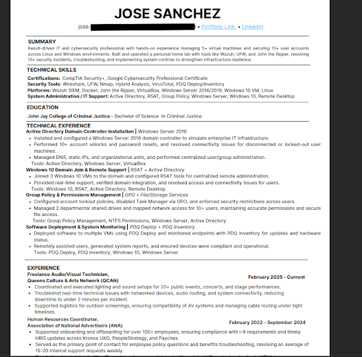

From the URL line, I can see the difference; this one below says: Private-Container within the URL. 

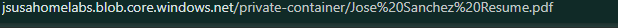

And this one says "public-container."
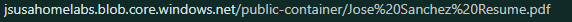

What if we wanted to add rules within our containers? 

I would need to go to Data Management, under Lifecycle Management, and click on Add Rule. 

With this rule, I want to change the file to a different tier after 30 days. Instead of Hot, it will now be under Cold Tier. Lowering the cost of this specific data. 
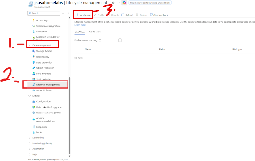

With the lifecycle management policy, you can:

Transition current versions of a blob, previous versions of a blob, or blob snapshots to a cooler storage tier if these objects aren't accessed or modified for a period of time, to optimize for cost.

Transition blobs back from cool to hot immediately when they're accessed.

Delete current versions of a blob, previous versions of a blob, or blob snapshots at the end of their lifecycles.

Apply rules to an entire storage account, to select containers, or to a subset of blobs using name prefixes or blob index tags as filters.

Under Rule name: 30-days
Rule Scope: Apply Rule to all blobs in your storage account
Blob type: Block Blobs
Blob subtype: Base blobs
Then click Next. 
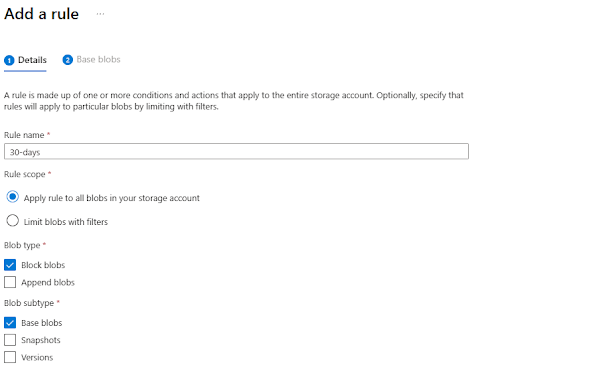

The second stage is setting this up. We are automating this rule to go into effect with the right parameters. If the base blobs were last modified 30 days ago, then move the blob to the cool storage. 

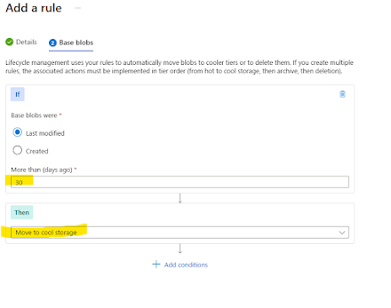

Now it is set up! 
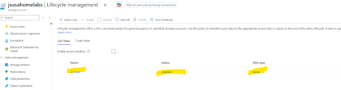

So how do we access these files in our applications? Well, on the left-hand side under "Security + Networking" --> "Access Keys," there will be a set of keys we would need to add to the application in order to access our Storage Account with the right permissions. 

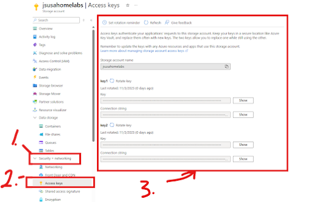

We would need to open Azure Storage Explorer. Open the left-hand side, click on Overview, and then Open Explorer. 

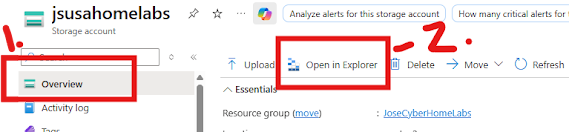

I would have to follow the link provided and install Microsoft Azure Storage Explorer Version 1.40.1

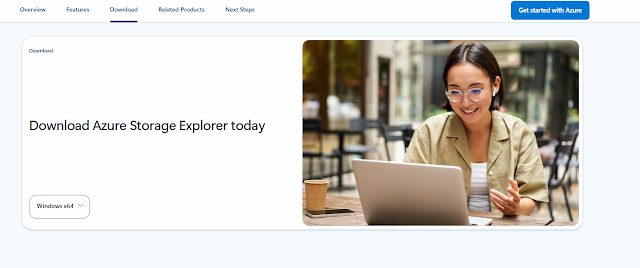
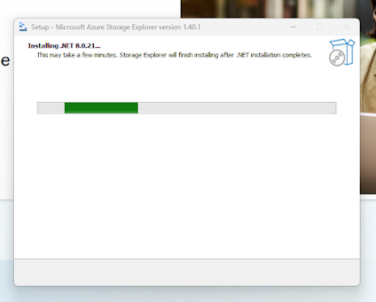

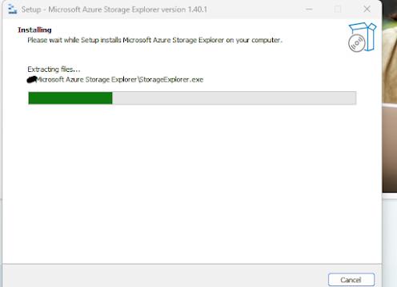
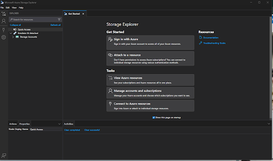

Now that Microsoft Azure Storage Explorer is installed, I can go back to access keys and grab Key 1 and attach it to a resource on the Explorer. 

Copy the Connection String and attach to a Resource (Storage Explorer) 
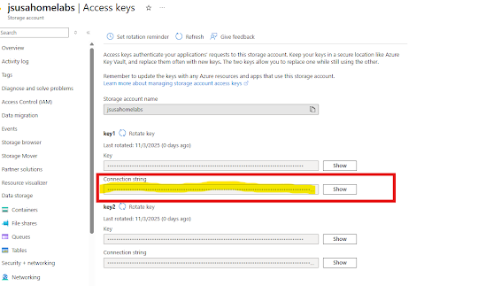

I need to click on Storage Account or Service 
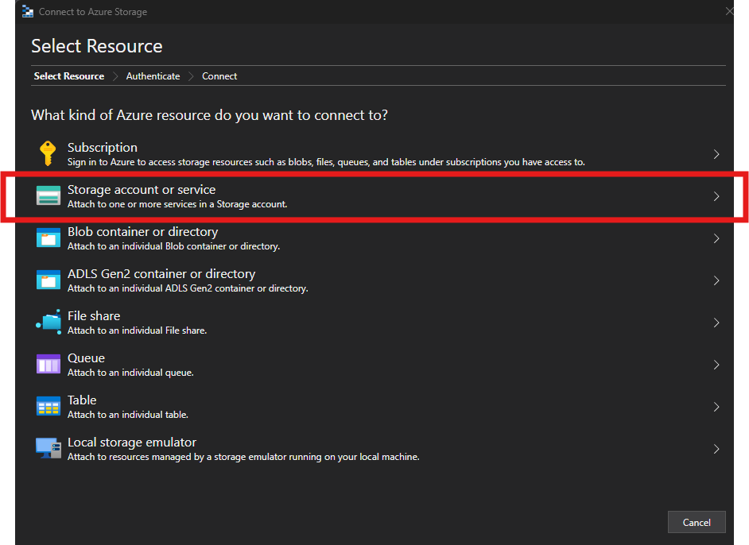

It is asking me how I will connect to the Storage account. I have the Connection String and click on next. 

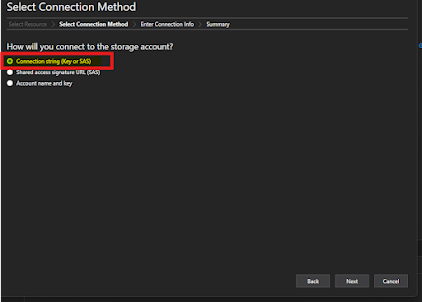

Paste in the connection string and click on Next
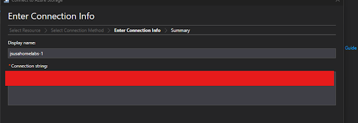

I can see the Display/account name, which is what we created, "jsusahomelabs." 
The Account key and the Endpoint Protocol "HTTPS", and then click Connect. 

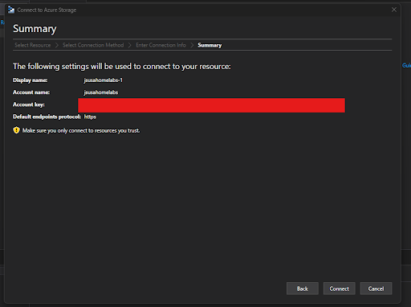

I can now view the files from here. 
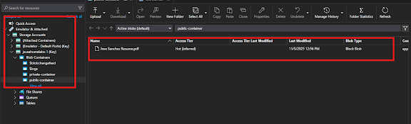

What if one day I were working on deleting multiple containers and selected the "public-container" and deleted it? I was then told by a co-worker Hey, I can't access our resume that was attached to the Public container. I would go back and restore it. 

Here is how I would do that. First, let's delete it. Let me select the public container and delete it. 

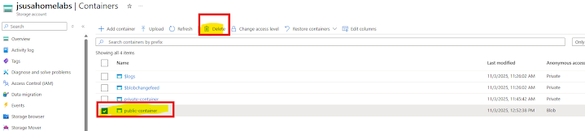

Let's confirm we want to delete it. As mentioned before, imagine there were 100 containers we wanted to delete. I was working fast and skimming through each line and missed "public-container". Now that I deleted it, is there a way to get it back?  
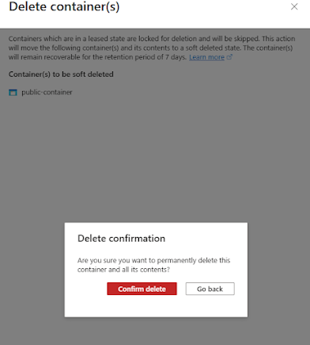

On the right-hand side, there is a drop-down menu that states, "Only show active containers." 
I can now click on "Show active and deleted containers."

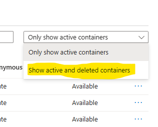

The menu has now changed, showing "public-container" status, saying it is "deleted."
If I click on the 3 dots on the right-hand side, I can undelete this container. 

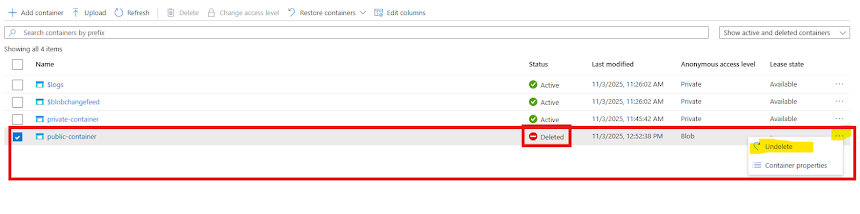

Then I would have to save at the bottom to confirm my changes. 

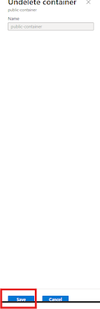

It is now active. 
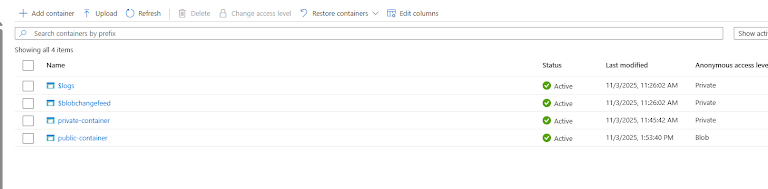

