# Secure-Cloud-File-Sharing-for-Team-Collaboration

## Objective
I configured secure file sharing to allow authorized users to access company files for viewing, downloading, or editing as needed. This supports common business use cases such as sharing reports with internal teams, granting contractors limited access to specific project files, and hosting approved marketing materials for public distribution. To implement this, I navigated to the Azure Storage service and configured file shares within the storage account.

## Skills Learned

- Created department-specific file storage (Finance) to keep sensitive information organized and controlled.
- Applied storage limits to prevent unnecessary cloud costs and manage usage responsibly.
- Implemented backup and recovery options to protect files from accidental deletion, ransomware, or system failures.
- Enabled easy employee access by connecting cloud file storage directly to a computer like a shared network drive.
- Demonstrated how companies can restore previous versions of files, reducing downtime and data loss.

## Steps

 File sharing makes files accessible to others so they can view, download, or edit them in a company. This could mean sharing reports with your team, giving contractors access to specific project files, or hosting marketing materials for public downloads. I want to set this up on my Azure Storage. I need to go to the Storage menu and head into File shares. 
On the left-hand side, I need to look for Data Storage and click on File Shares. I now want to create a new File Share. 

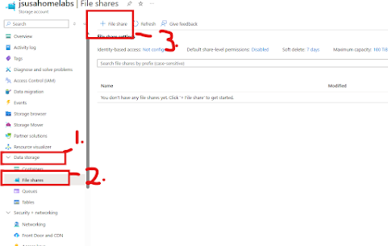

I want the file share name to be finance, and the access here to be transactionally optimized. The protocol will be SMB for now. And it is going to give me a vault name with a backup policy and just basic policy details. I'm going to hit create and wait for the validation to pass.

I want to upload some files to Finance. 
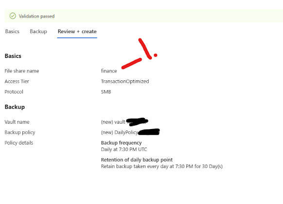

We can create a Directory, which lets us create a subdirectory, which I will do now and call it "FinanceDirectory1."
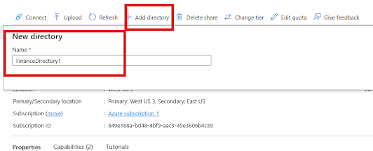

The Quota on the tab to the right is how much data can be stored within the file. Right now, we have 1024000, meaning 102 TB, which is too much. Let's bring it to 5 GB. 

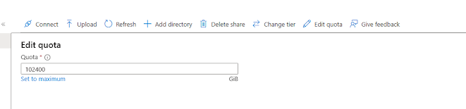

A backup vault in Azure is like a secure digital safe where copies of your files are stored. The way I think about it is a backup copy of your cloud file cabinet. If anything happens to your original file, such as an accidental deletion, corruption, ransomware, or a hardware failure, the backup vault ensures that it can restore it to the exact state that it was in previously.

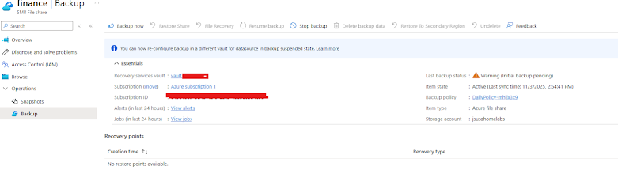

Now that it has been deployed, let's load up the share and connect to it. 

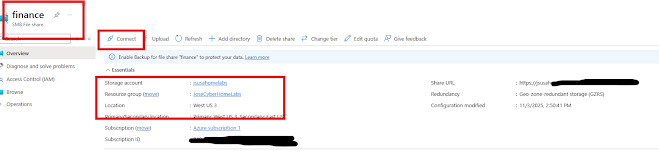

On the right-hand side it we need to make sure it is selected on Windows and assign it a drive letter. Then, copy the Script and open Windows PowerShell ISE on my computer. 

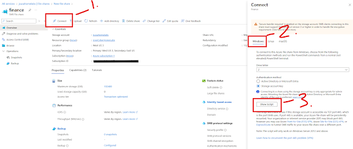

Well, we just copied is a command that will test to make sure that we can reach the file share, which is the storage account.file.co.windows.net, then it's going to create a key with the username\storage\account name and the password, which is one of the keys for the storage account. 

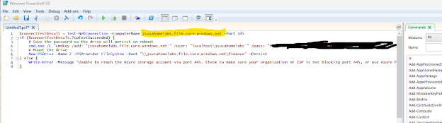

Let's run the script. 
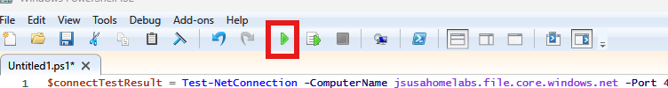

Now I can see that it is in my Network Locations. 

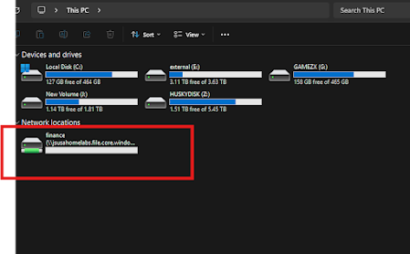

If I double-click the Finance drive and see what's inside, I can view the Directory I made, "FinanceDirectory1," and my PNG Screenshots I added. 
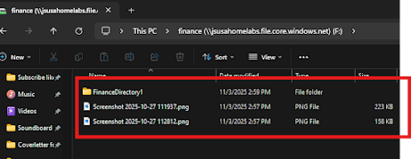

If I go to my Credential Manager program on my own computer under Windows Credentials, I can view the most recent credential added to the computer. I see my Storage file directory added. 
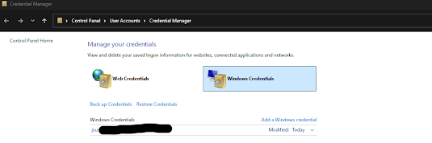

Something I found out, there is another way of adding this File share using Active Directory, but I have not added that yet. I will set this up in another blog post. 

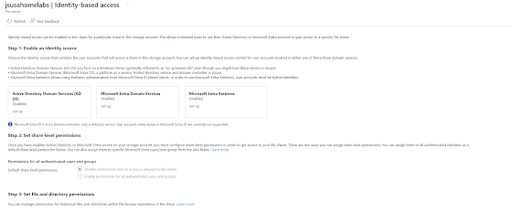

If I ever want to create a snapshot of my File share on Azure, I can create a snapshot, and it will tell me the time, who initiated it, and any comments left from other team members. 
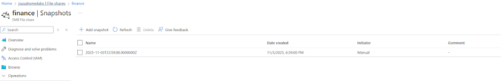

I can also revisit the previous snapshots on the file share drive on my computer by right-clicking the drive and clicking on properties, and then clicking on Previous Version. 

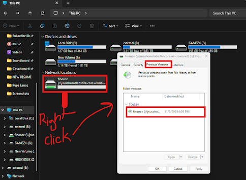

