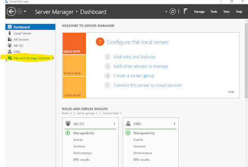

# Active Directory — Shared Drives and Security Groups

**Environment:** Windows Server 2016 | VirtualBox | On-Premises Domain Controller  
**Skills:** Active Directory Users and Computers · SMB File Shares · NTFS Permissions · Security Group Management · Drive Mapping · Least-Privilege Access Control

---

## Objective

IT administrators need a way to manage employees, computers, and security settings from one place. Think of it like this — imagine if every time someone at a company needed access to a file, someone had to physically walk over to their desk and set it up manually. That would be chaos. That is why companies use **Active Directory** on a **domain controller**.

A domain controller is the brain of a company's computer network. It keeps track of every user account, every computer, and every rule about who is allowed to do what. When you log into your work computer and it asks for your username and password, it is checking with the domain controller to verify your identity. When your manager tells IT to give you access to a shared folder, the domain controller handles that too.

For this project, I set up Windows Server 2016 inside a virtual machine using VirtualBox and configured it as a domain controller to simulate how a real company's IT environment works. My goal was to create shared drives that employees can access from their own computers and use security groups to control who gets in.

---

## Step 1 — Open Server Manager and Navigate to File and Storage Services

Server Manager is the control panel for Windows Server. I opened it and clicked on **File and Storage Services** in the left sidebar, then navigated to **Shares**.

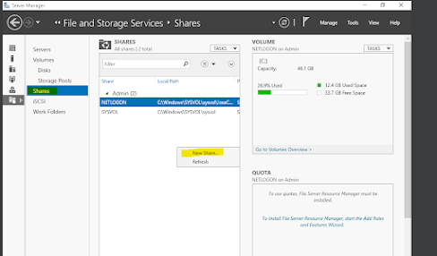

---

## Step 2 — Create the HR Shared Drive

I clicked **New Share** to launch the share wizard. I selected **SMB Share – Quick** as the share profile. SMB stands for Server Message Block — the standard way Windows computers share files across a network. The Quick option is the most common choice in a corporate environment.

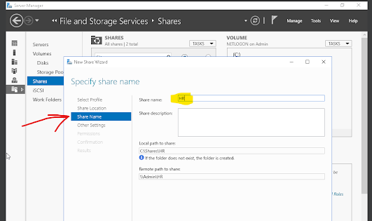

I named the first share **HR** — this would be the shared drive for the HR department. The wizard automatically created the folder path `C:\Shares\HR` and the network path `\\Admin\HR`.

I confirmed the settings and clicked **Create**.

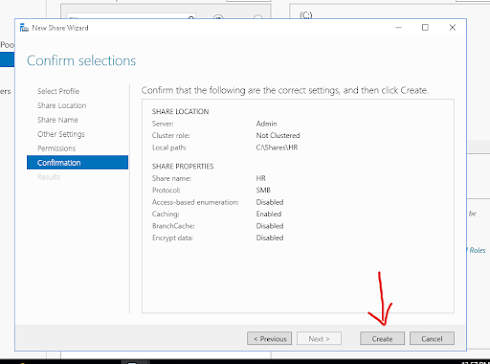

---

## Step 3 — Create the Personal Shared Drive

I repeated the same steps to create a second share called **Personal** — individual storage, so each employee has their own private space on the server.

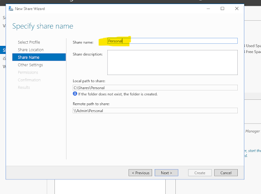

Both folders now exist on the server's Local Disk C: inside the Shares folder. They exist on the server, but nobody can access them yet — that comes next.

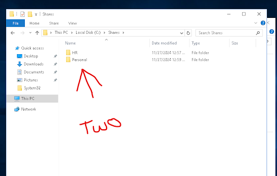

---

## Step 4 — Create a Security Group in Active Directory

Rather than assigning folder permissions to individual users one by one, I created a **security group** called HR. Then I gave the group access to the HR folder — so anyone in the group automatically gets in. This is much smarter than a person-by-person assignment. When someone new joins HR, you add them to the group, and they instantly have access to everything the group controls. When someone leaves, you remove them and all their access is gone in one step.

I opened **Active Directory Users and Computers**, right-clicked the **Users** folder, went to **New**, and selected **Group**.

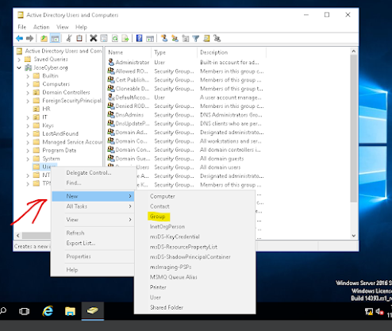

I named the group **HR** and set the group type to **Security**. There are two types of groups in Active Directory: Security groups control access to resources like files and folders. Distribution groups are used for sending emails. Since I am controlling folder access, Security is the right choice.

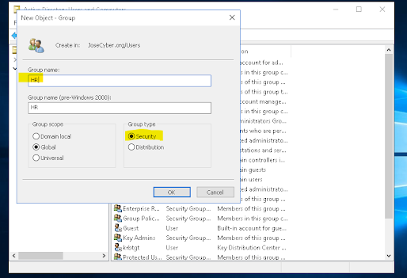

> **Pro tip:** In a real work environment, open the security group and check the **Managed By** tab to record who is responsible for the group. That way, if someone needs to be added or removed, you know exactly who to contact.

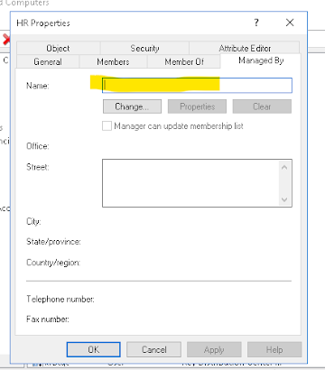
---

## Step 5 — Add the Network Path to the Group Description

I navigated to the HR folder, right-clicked, went to **Properties → Sharing tab**, and copied the **Network Path** (`\\Admin\hr`).

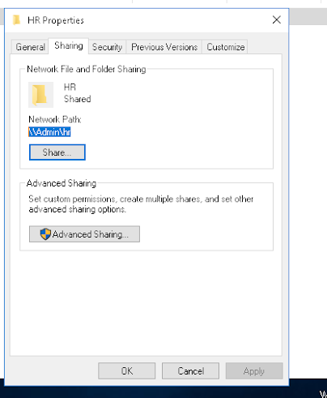

I went back to the HR security group in Active Directory and pasted that path into the **Description** field. Any IT admin who opens the group in the future can immediately see which folder it controls without hunting through the file system.

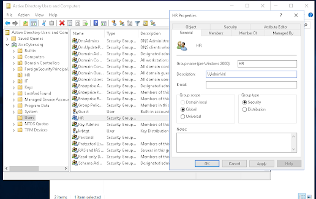

---

## Step 6 — Add Users to the Security Group

I double-clicked the HR security group, went to the **Members** tab, and clicked **Add** to search for users.

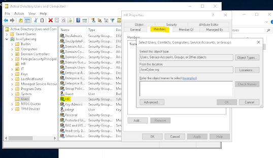

I added **patty2** (Patty in the HR department) to the HR group, granting her access to the HR shared drive.

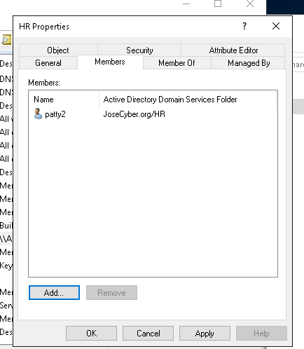

I also added Patty2 to the **Personal** group so she would have her own personal storage folder.

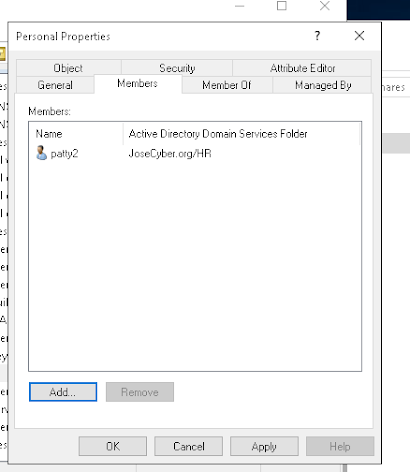

To verify, I opened Patty's user account and clicked the **Member Of** tab. Both HR and Personal groups appeared, confirming her access is set up correctly.

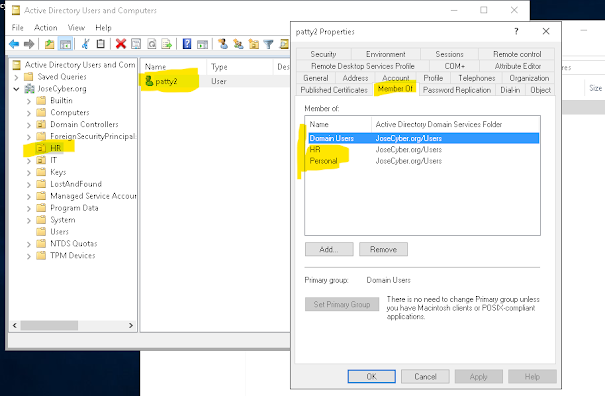

---

## Step 7 — Set NTFS Permissions on the Personal Folder

When you create a shared folder on Windows, it comes with default permissions that are too broad — it basically lets everyone in. I needed to set **explicit permissions**, writing my own rules for exactly who can access what.

I right-clicked the Personal folder, went to **Properties → Security tab**, and clicked **Advanced**.

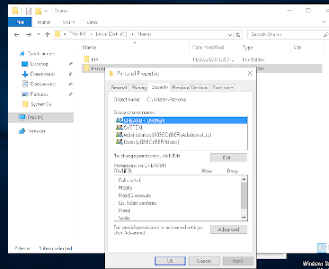

I clicked **Disable Inheritance** at the bottom. This means: stop copying permission rules from the parent folder — I want to write my own rules specifically for this folder.

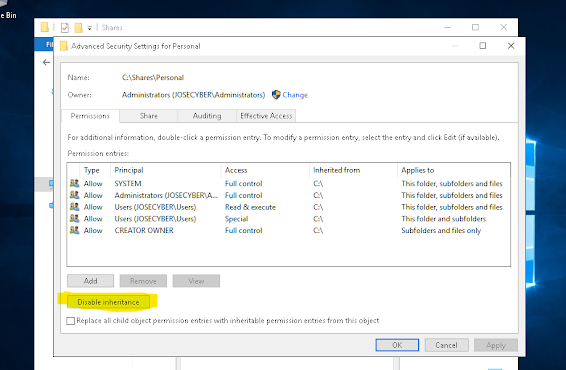

Windows asked what to do with the existing rules. I selected **Convert inherited permissions into explicit permissions** — this keeps the current rules while making them editable, so I can remove unwanted ones.

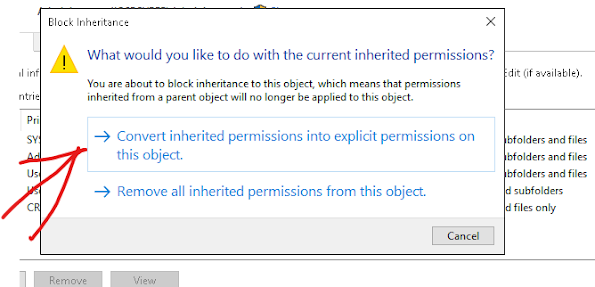

I selected the broad **Users** group from the list and removed it. This is the default group that gives general access to basically everyone — gone.

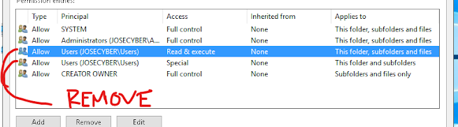

I clicked **Add** to create a new permission entry.

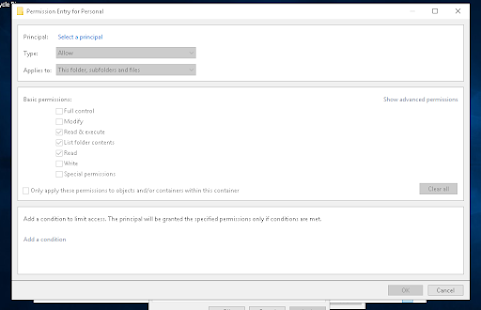

I clicked **Select a Principal**, typed in **HelpDesk**, and clicked OK.

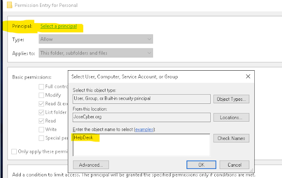

Under Basic Permissions, I checked **Modify**. This lets the Help Desk open files, edit them, and organize the folder — but they cannot delete the folder itself or change who has access to it. That boundary is important.

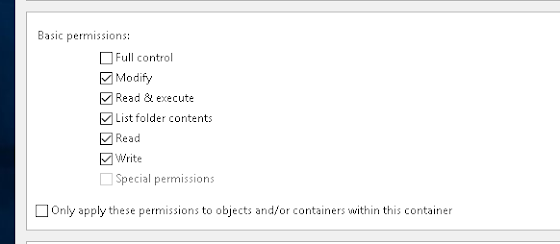

---

## Step 8 — Set Permissions on the HR Folder

I applied the same process to the HR folder. The Advanced Security Settings now show the HR security group with **Modify** access — only HR group members can work with files in this folder.

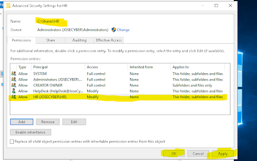

I then went to the HR folder **Properties → Sharing tab** and clicked **Share** to set the share-level permissions.

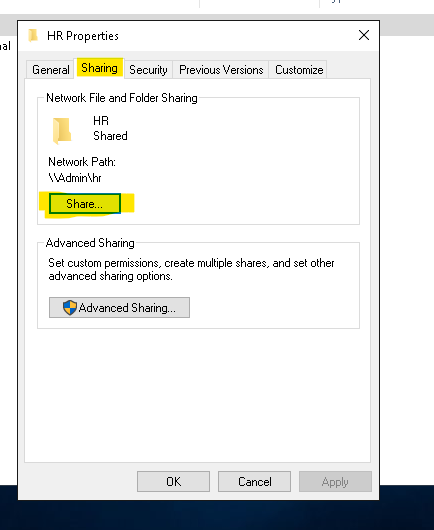

In the File Sharing dialog, I found the HR group, clicked the dropdown next to its permission level, and selected **Read/Write**. This means HR group members can open files and make changes to them.

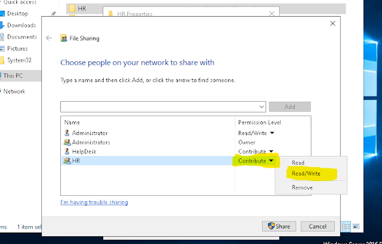

---

## Step 9 — Verify the Shared Drive is Visible on the Network

Before mapping the drive, I verified that the Personal share was visible on the network. On the left is the Admin machine showing the share properties, and on the right is the network view showing that the share is accessible.

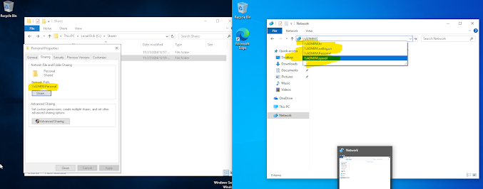

---

## Step 10 — Map the Network Drive on the User's Computer

Now I needed the shared drive to actually show up on Patty's computer. This process is called **mapping a network drive** — it connects a folder on the server to a drive letter like Z: that appears in File Explorer, just like a USB drive would.

On Patty's virtual machine, I right-clicked **This PC** and clicked **Map network drive**.

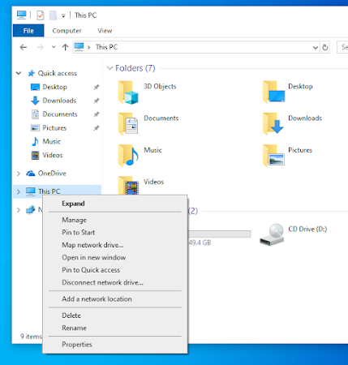

I typed in the network path `\\ADMIN\HR`, chose drive letter Z:, and checked **Reconnect at sign-in**. Without that checkbox, the mapped drive disappears every time the computer restarts. Checking it means the drive reconnects automatically every time Patty logs in.

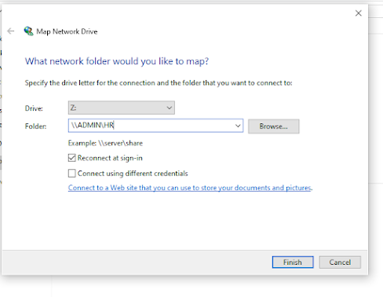

The HR shared drive now appears under Network Locations in Patty's File Explorer with the drive letter Z:.

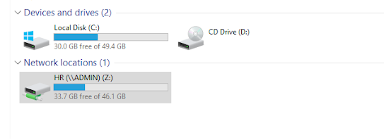

---

## Step 11 — Automate Drive Mapping Through Active Directory

Mapping the drive manually on one computer works, but doing this across 50 computers is not practical. The smarter approach is to configure it directly on the user's account in Active Directory so the drive appears automatically on any computer Patty logs into.

I opened Patty's account in Active Directory, clicked the **Profile** tab, and under **Home folder** set **Connect Z:** to `\\ADMIN\Personal\%username%`.

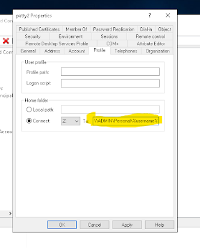

The `%username%` is a variable — a placeholder Windows automatically replaces with the actual username of whoever is logging in. For Patty, it becomes `\\ADMIN\Personal\patty`. For any other user, it becomes their own unique folder path. One setting works for everyone.

After clicking Apply, the path updated automatically to show Patty's name.

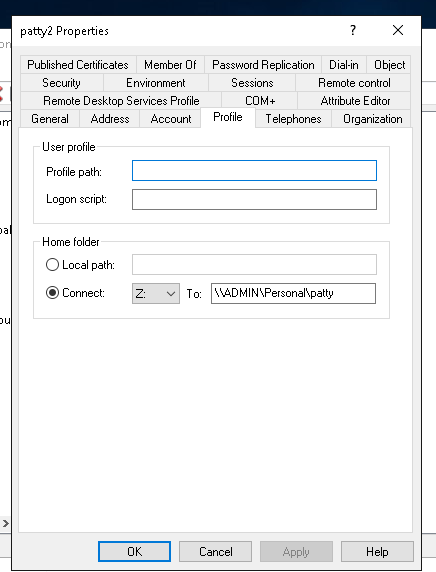

Patty's personal drive now appears automatically in her Network Locations every time she logs in — no manual setup needed on any machine.

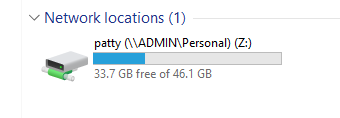

---

## Lessons Learned

**NTFS permissions and share permissions are two separate layers.** Early in the lab,b I set share permissions but forgot to configure NTFS permissions on the underlying folder. The drive appeared mapped, but access was denied. Both layers must align. In a real environment, this permission mismatch is one of the most common causes of Help Desk access tickets.

**Disable inheritance before setting explicit permissions.** If you try to add custom permissions before disabling inheritance, the parent folder's inherited rules can override your changes. The correct sequence is: disable inheritance → convert to explicit → remove unwanted groups → add correct groups.

**The `%username%` variable is a force multiplier.** Hardcoding a path for each user is a scalability trap. Using `%username%` in the profile path means a single setting covers every user — this is the difference between someone who knows the tool and someone who knows how to use it efficiently.

---

## What Businesses Should Do

**Use security groups, never individual user permissions.** Always assign folder permissions to a group, then add users to the group. When someone leaves the company, remove them from the group — the folder permissions stay clean without any editing required.

**Document the share path in the security group description.** This one habit pays off during audits, access reviews, and troubleshooting. Any administrator who opens the group immediately sees which resource it controls.

**Implement least privilege on all shared drives.** The default Everyone: Full Control permissions are a security risk. Every shared folder should have inheritance disabled, the default Users group removed, and only the specific security group granted the minimum permissions needed.

**Automate drive mapping through Group Policy or AD user profiles.** Manual drive mapping does not scale. Use GPO drive mapping or the AD Profile tab with `%username%` so every new hire gets the correct drives automatically on first login, reducing onboarding tickets and human error.
