# Building-Smarter-App-Communication-with-Azure-Storage-Queues

## Objective
 Azure storage queues are like a message delivery system that helps different parts of an application talk to each other without needing to be online or active at the same time. This is part of Azure's storage, and the main goal is to temporarily store messages; it's similar to a "to-do" task until another service or app is ready to process them. 

The way I would explain this to someone who might not understand is like Tony Stark's Jarvis system. Tony Stark talks to Jarvis all the time and gives him commands such as "Run a diagnostic after getting hit, or Order a cheeseburger." Instead, Jarvis uses a message queue where each instruction gets stored and handled in order and when ready. That's what Azure cues do when they organize and manage communication between systems. 

### Skills Learned

- Set up a cloud-based queue to store and manage messages reliably, even when applications are busy or offline.
- Created and managed messages with expiration timelines, helping prevent outdated or unnecessary data from piling up.
- Connected cloud services to applications in a secure and controlled way.
- Demonstrated how businesses improve system reliability and performance by separating tasks instead of processing everything at once.
- Gained experience monitoring and verifying message flow using cloud management tools.

## Steps

Down below, I will create a step-by-step guide on how to use Azure storage account queues with screenshots of my Azure account. 

To create an Azure Queue, I would need to go into Storage and, on the left-hand side under Data Storage, I would need to click on "Queues."

I then clicked on Add Queue.

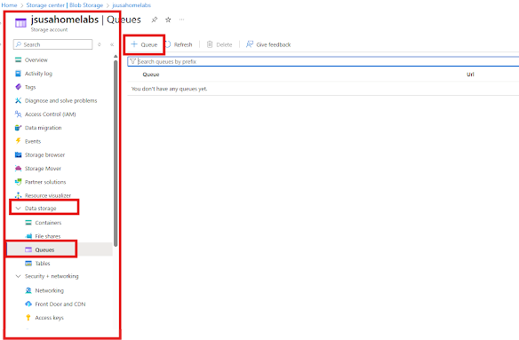

I will name it "josequeue1".

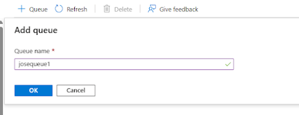

I will click on the new queue. 
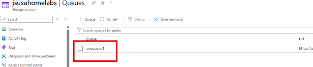

I created a new message and wrote in the Message Text box "Message 1". I then left the "Expires in" options as is, with 7 days of expiration. and clicked on "ok" to create this message. 

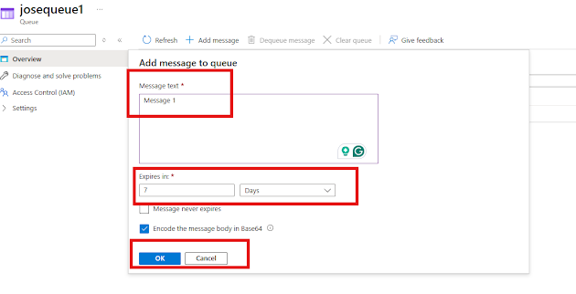

I repeated the same process twice, creating 2 more messages. 
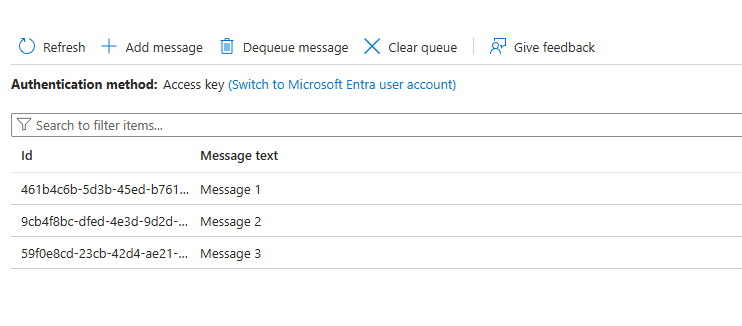

How do we connect a queue to our application? On the left-hand side, under Security + Networking, I clicked Access Keys.
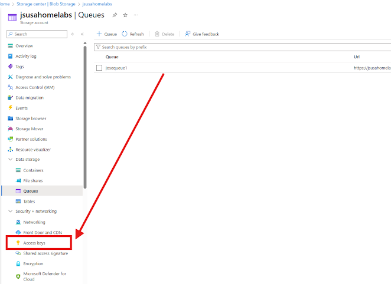

I clicked on the connection string from key one and copied it.
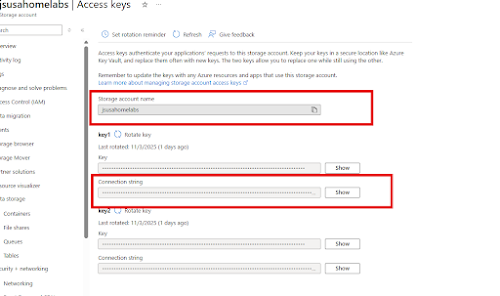

I opened Microsoft Azure Storage Explorer and clicked on "Attach to a resource."

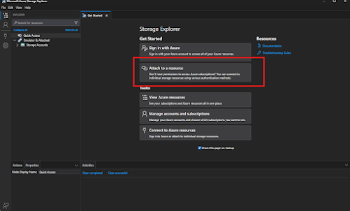

I clicked on "Storage Account or Service."

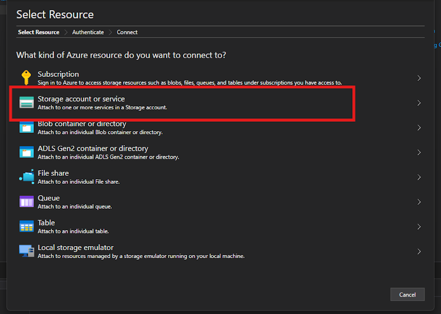

Clicked on "Connection String" and then clicked on "Next."

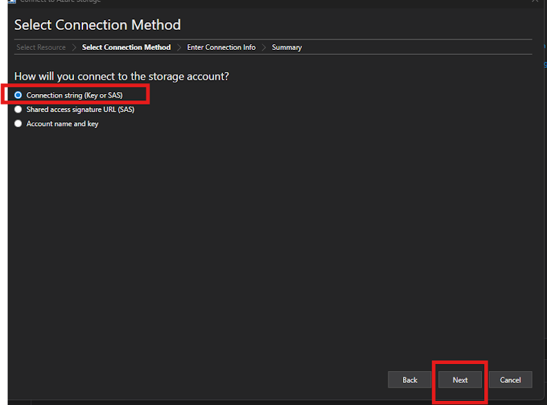

I then pasted the Connection String and then clicked "Next." 

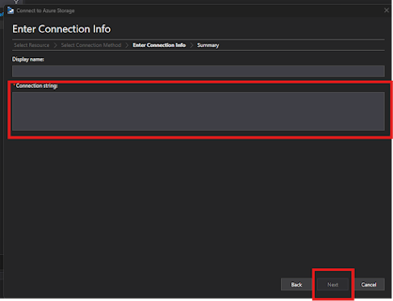

I verified the display name and account name. I verified the account key was correct and then clicked on "Connect."

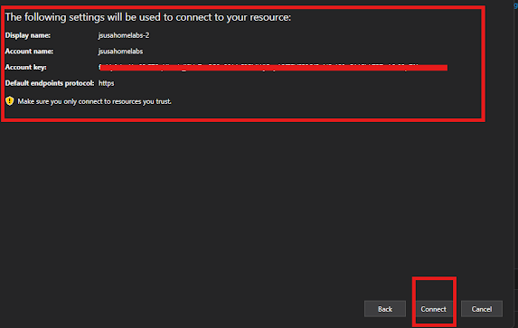

Under "jsusahomelabs-1" --> "Queues" --> josequeue1, I can see my messages. 

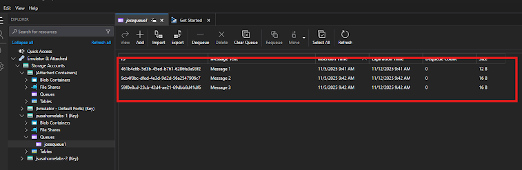

