# MDM-Mobile-Device-Management-Using-Maas360

## Objective 

In this lab, I set up a Mobile Device Management (MDM) environment using IBM MaaS360 to simulate how IT teams securely deploy, monitor, and control company devices. This project focuses on endpoint security, policy enforcement, user role management, and data protection, which are critical responsibilities in IT Support, Help Desk, and Security teams. Without MDM, lost devices can expose company data. Anyone could access email, files, or internal apps. 

Today, I will be using MaaS360, a cloud-based Unified Endpoint Management (UEM) platform that enables organizations to manage, secure, and monitor endpoints such as mobiles, laptops, desktops, IoT, and wearables from a console. My goal is to understand and maintain security, compliance, and data control over devices and applications. 

## Steps Taken 

1) I went to the website https://www.ibm.com/products/maas360 
Clicked on Try it free. 

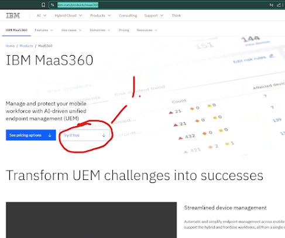

2) Input the necessary information to create the account. 

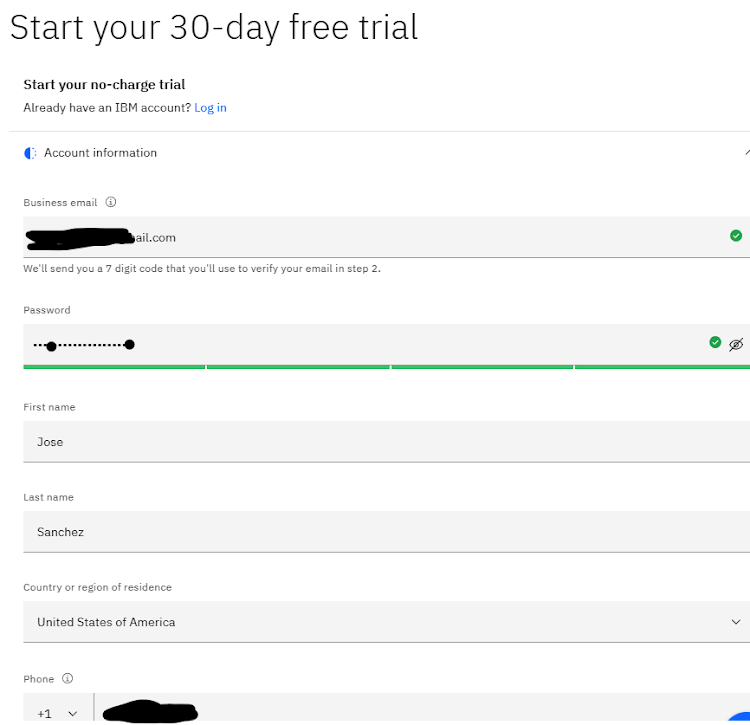

3) It sent me a code to activate my account. I would need to input that code. 

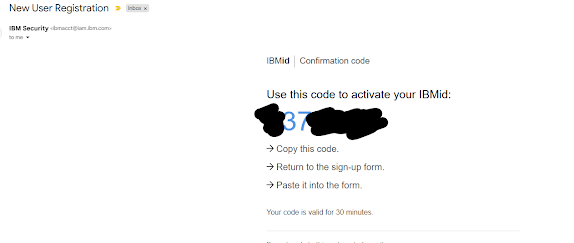

4) I logged into the MaaS360 and was given a guided, quick setup of my account and Apple or Android devices. 
Quick Start
You will be guided for a quick setup of your account through the following steps : 
Set up Apple Enrollment (recommended)
This is required to be able to enroll and manage Apple devices. You will need :
Company Apple ID
Apple Push Notification Service (APNS) certificate
Set up Android Enterprise (recommended)
This is required to be able to enroll and manage Android devices. Android Enterprise offers enrollment modes such as Work Profile, Device Owner, Dedicated Devices, and Work Profile on Company-Owned Devices. You will need:
Managed Google Play account (if you don't have G-Suite for Business)
Domain name and EMM token (if you have G-Suite for business)
Set up security policies
Configure corporate email
You will need this if you want to set up email on the email app that is pre-installed on your users' devices. You will need :
Email provider hostname
Enroll devices

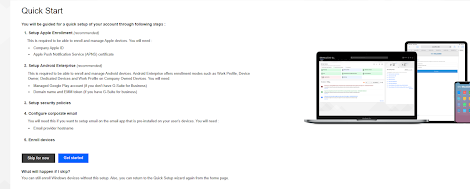

This shows how MDM connects with Apple, Android, email, and security certificates. In real companies, IT has to link all these systems so devices can be managed properly.

5) At the home Tab, I can see that I have 0 devices connected, 0 users, 2 Apps, and 3 policies in use. I want to create a User first. 

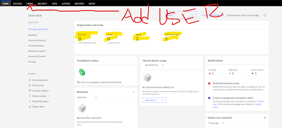

6) I clicked on Add User and filled out the information that this user will have for documentation purposes. 

It will ask me for a password, which would be the Company's password. 

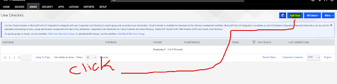

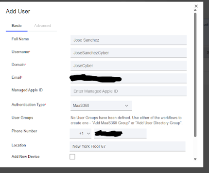

7) Now I can see this was set up, and the username is "josesancezcyber". With the information we added.
This connects the device to a person. Policies and apps are assigned based on the user’s role. This is part of access control.

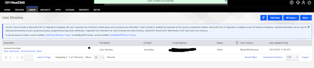

8) When I clicked on the Security Tab, I could see the 3 policies that were step number 4. This is also shown on the home screen dashboard. 

I want to add a new policy. 

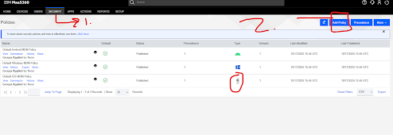

I also received a welcome email about the device and that it was enrolled in MaaS360. 

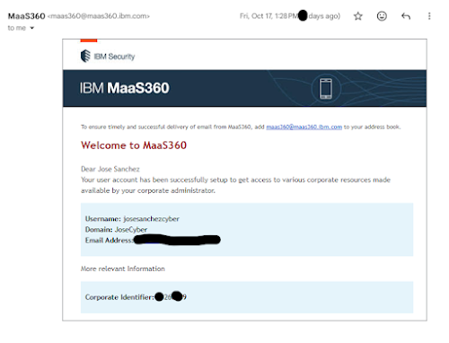

9) To verify that my MDM is working, since this is a test, I will fill this page out. 
Policy: Test. 
Description: Test Device for MaaS360. 
Type: IOS MDM
Start From: My Existing Policies
My Existing Policies: (def) Default IOS MDM Policy

Then click Continue. 

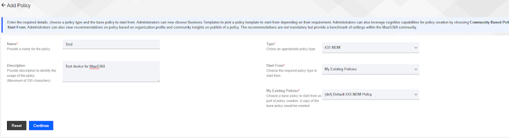

10) I clicked on Edit on the top right-hand side corner. 

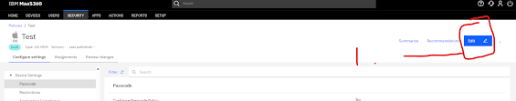

11)  I am going to enable Configure Passcode Policy, which means that the devices will have a minimum passcode length of six, and it will allow simple passcodes. 
I will change the Mimi, Passcode Length to 6. Passcode rules can stop someone from easily getting into a lost or stolen device. This is basic device security in most companies.

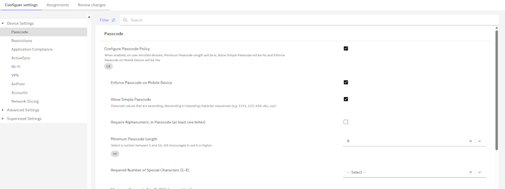

12)  I will change the Required Number of Special Characters to 4 and click on Next. 
I would click next until I had reviewed the changes and clicked on Publish. 

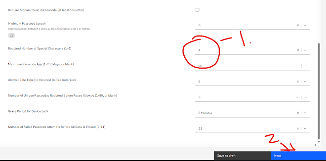

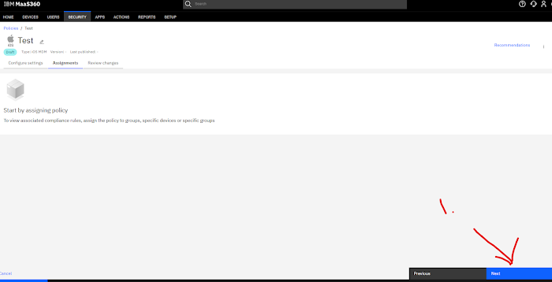

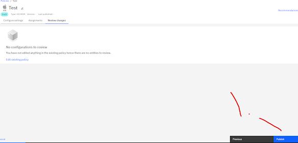

13) I clicked on Confirm, and then I had to input my password and confirm. 

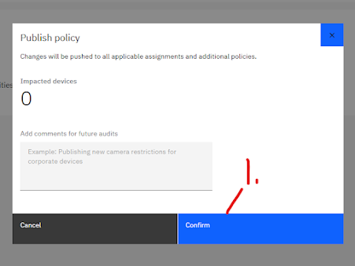

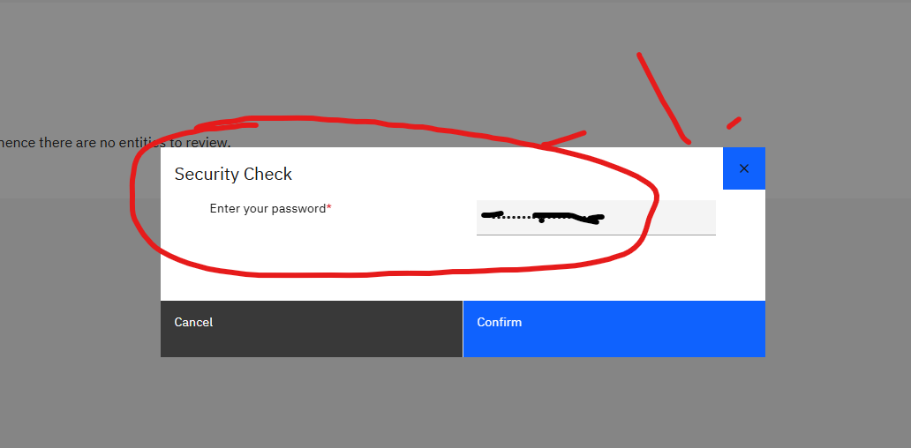

I can see that it was successful. 

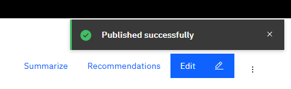

I was told by a couple of my friends who are IT professionals, and they said that they had a policy that the devices handed to employees restricted the use of the camera. They were not allowed to take pictures on that device. What if I wanted to restrict that as well? I can. 

14) On the Test Policy, in the configure setting, I clicked on Restrictions and looked for Allow Use of Camera: Yes. 
I must change it to no. Meaning I have now restricted the user from taking pictures and videos. 
Some jobs don’t allow cameras. Places like hospitals, finance offices, or secure buildings use this to prevent photos of sensitive information.

I must confirm the settings and wait for them to take effect. 

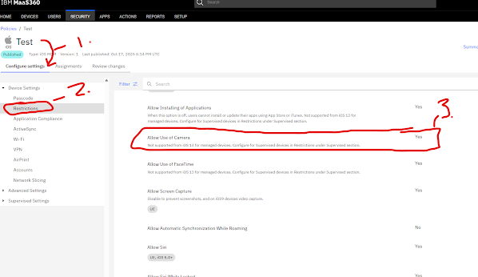

I can see now that it worked! 
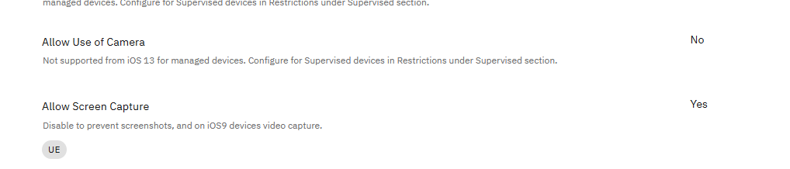

15) Now, what if we want to allow access to apps? I want to look at the "Apps" Tab and click on Catalog. 
Then click on Add on the top right-hand side. 

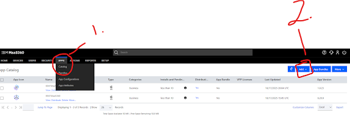

16) I want to click on "iTunes App Store App." I will search for specific apps that will be allowed to install or pre-install on the devices. 

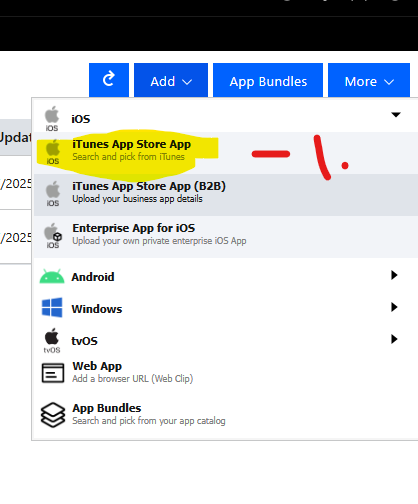

17) I am going to look for the App called Maa360 and click on the IBM MaaS360 Device: iPhone, iPad Category: Business Price: Free. 

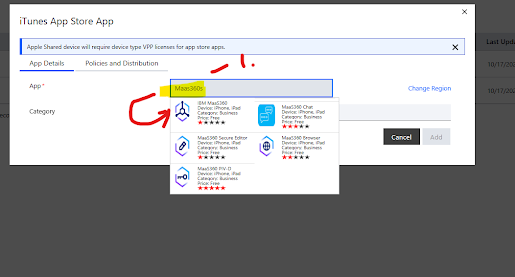

18) On the "Policies and Distribution" tab, I want to apply MDM Control Removal, Selective Wipe, Deletion from portal, or stop distribution. I also was to apply "Update Automatically."

This lets IT control which apps employees use. It lowers malware risk and stops people from installing unsafe apps.

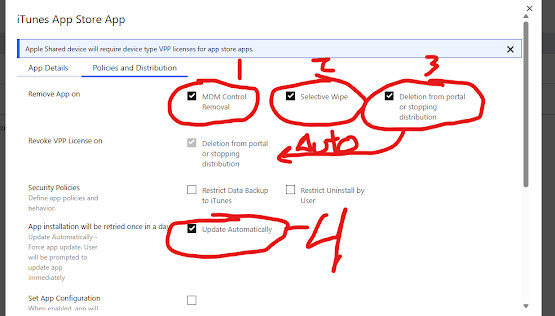

19) On the "Distribute To", I want to search for "Group" and "IOS Devices", meaning I want all IOS Devices for the company to have this App on the device with the same settings. 
Then I clicked on Add. 

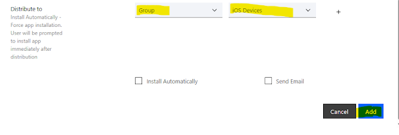

Now I can see the App Catalog has updated.

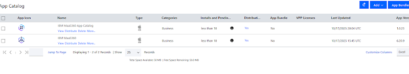

20) What I want to set up is a new role for my Help Desk Specialist. I would need to go to the "Setup" Tab and select "Roles."

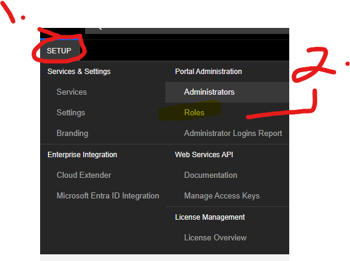

21) On the top right-hand side Corner, I would need to select "Add Role."

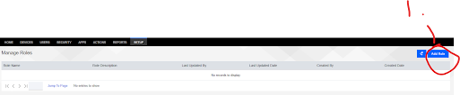

22) I will fill out the Role Name: Help Desk
Role Description: Tech Team Level 1/2 

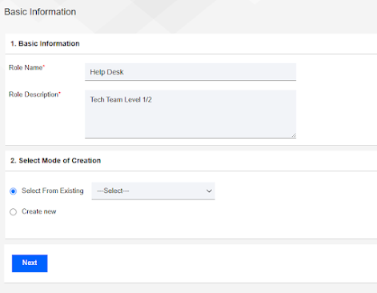

23) In the Select Mode of Creation tab, I would select "Select From Existing" and look for "Help Desk" and click on Next. 

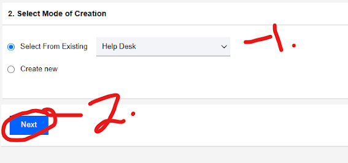

24) Since I selected Help Desk, it automatically granted certain "Access Rights."

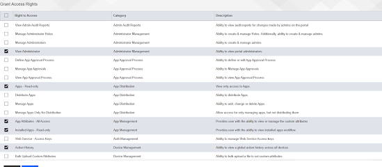

25) I want to click on save, and then it will prompt me to add my password to approve the new configurations. 

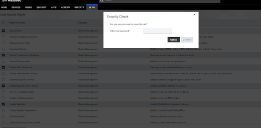

It lists what the Help Desk Team can do in MaaS360. 
1. Apps - Read-only
2. App Attributes - All Access
3. Installed Apps - Read-only
4. Action History
5. Device Enrollments - Read-only
6. Enable Watchlist
7. Remote Control
8. User Views - Add User and Device
9. Users - Read-only
10. Mobile Metrics - View and Propose new ideas
11. View Patches
12. Manage Policies - Read-only
13. Reports
14. Windows Packages - Read-only
15. View Administrator
16. Buzz Device
17. Device View - Read-only
18. Distribute patches for a device
19. Locate Device
20. Lock Device
21. Manage Device Enrollments
22. Merge Duplicate Device Records
23. Refresh Device Information
24. Reset Device Passcode
25. Send Message
26. Set Custom Attribute Value
27. View Exceptions
28. View Installed Apps
29. View Location Information
30. View Groups
31. View Risky App

26) Now I want to add my help desk employee to Maas360. 
1. I select the "Setup" tab
2. I click on "Administrators" 
3. I click on "Add Administrator." 

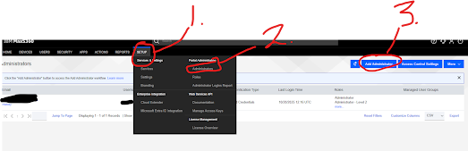

 27) I added the new employee's Email and added their name on the Administrator Details info page. And clicked on Next. 

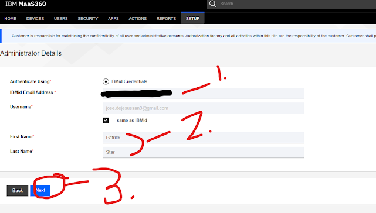

28) Now we can assign the role to this new Admin, who will be the Help Desk with the settings we configured earlier, and click on Next.

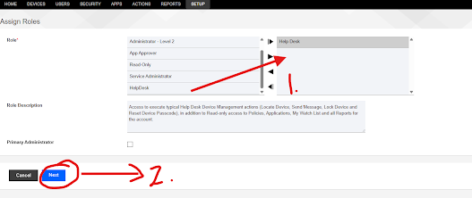

29) I would need to confirm that both the Username and the email address are correct and then click on Save. 

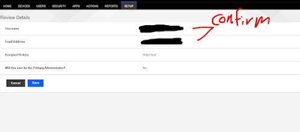

30) It states that the registered email address will get an invite and be added to the portal MAA360. Let's confirm that the Help Desk Agent received it. 

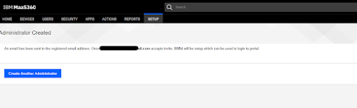

31) I was able to confirm that the Help Desk Agent received the invite. 

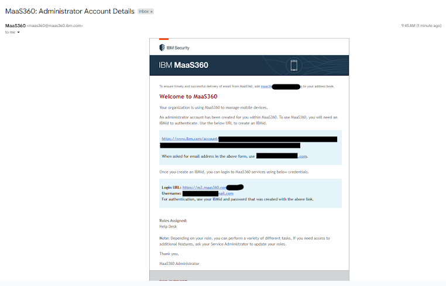

32) I clicked on the Link and set up my account with MaaS360 and made sure I followed the Directions in the Email.
I will then send the email a number token to verify the user and the account being accessed.  

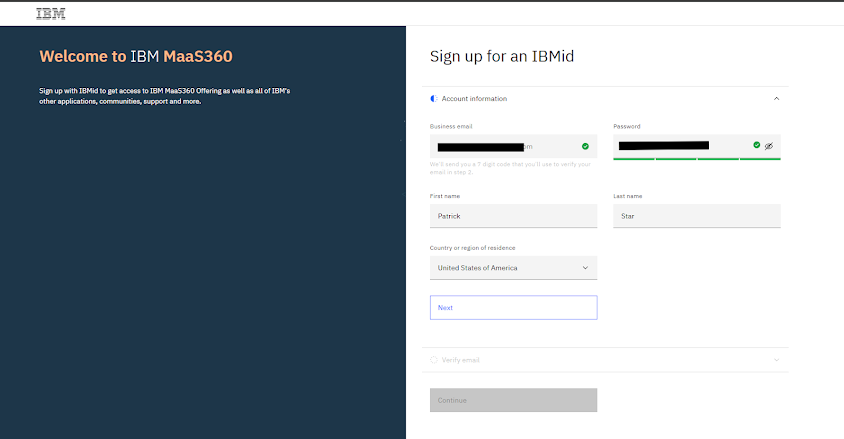

33) I would then have to input my profile information that MaaS360 is asking me for. For the sake of this lab project, I'm just going to keep certain things empty, but I will fill in the job title and the role.

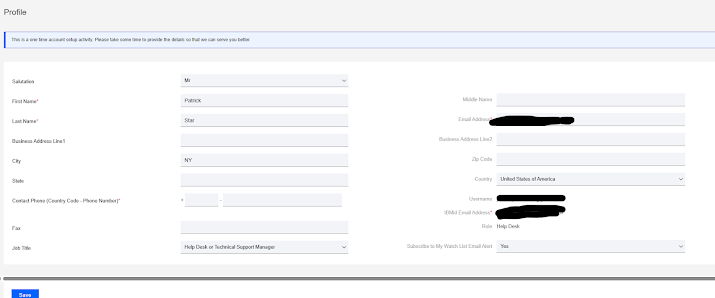

34) I went back to the administrator account and went to the tab called "Administrator" to confirm that the help desk agent is now active in MaaS360. 

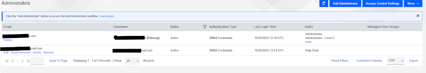

In this lab, I practiced device security, policy setup, app control, and user role management. These are common tasks in IT support and security jobs.
